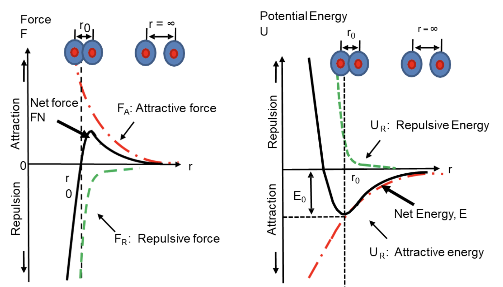

# Atomic Bonding and Crystal Structures

For discussion-style examples, see:

➡️ [Atomic Bonding Examples](./examples.md)

---

## 1. Bonding Basics

Atomic bonding is controlled mainly by valence electrons.

```math
\text{valence electrons}
\rightarrow
\text{bonding type}
\rightarrow
\text{crystal structure}
\rightarrow
\text{band structure}
\rightarrow
\text{electrical behaviour}
```

A bond forms only if the bonded state has lower energy:

```math
E_{\text{bonded}}<E_{\text{separate atoms}}
```

---

## 2. Interatomic Force and Potential Energy



When two atoms approach:

```math
F_N=F_A+F_R
```

where:

- $begin:math:text$F\_A$end:math:text$: attractive force
- $begin:math:text$F\_R$end:math:text$: repulsive force
- $begin:math:text$F\_N$end:math:text$: net force

---

### 2.1 Attractive Force

Main origin:

```math
\text{electron of one atom}
\leftrightarrow
\text{nucleus of neighbouring atom}
```

Approximate Coulomb-type form:

```math
F_A=-\frac{A}{r^2}
```

The negative sign represents attraction.

---

### 2.2 Repulsive Force

Dominates at very small $begin:math:text$r$end:math:text$.

Main causes:

- electron cloud overlap
- electron-electron repulsion
- nucleus-nucleus repulsion
- Pauli exclusion

Approximate short-range form:

```math
F_R=\frac{B}{r^m}
```

where:

```math
m>2
```

Key reminder:

> Both attraction and repulsion ultimately come from electromagnetic interactions. Atomic repulsion is written differently because it is an effective short-range effect involving electron-cloud overlap and Pauli exclusion.

---

### 2.3 Equilibrium Separation

At stable separation:

```math
F_N=0
```

So:

```math
|F_A|=|F_R|
```

The equilibrium separation is the bond length:

```math
r_0=\text{bond length}
```

---

### 2.4 Potential Energy Curve

Potential energy reference:

```math
U(\infty)=0
```

At $begin:math:text$r\=r\_0$end:math:text$:

```math
U=U_{\min}
```

So $begin:math:text$r\_0$end:math:text$ is not where $begin:math:text$U\=0$end:math:text$.

Equilibrium condition:

```math
F=-\frac{dU}{dr}
```

Therefore:

```math
F=0
\Rightarrow
\frac{dU}{dr}=0
```

---

### 2.5 Bond Energy

Bond energy:

```math
E_0=U(\infty)-U(r_0)
```

Since:

```math
U(\infty)=0
```

then:

```math
E_0=-U(r_0)
```

Deeper potential well:

```math
E_0\uparrow
\Rightarrow
\text{stronger bond}
```

---

## 3. Types of Bonding

| Bond type | Electron behaviour | Typical materials |
|---|---|---|
| Ionic | electrons transferred | NaCl, MgO |
| Covalent | electrons shared | diamond, Si, Ge |
| Metallic | electrons delocalised | Cu, Al, Fe |
| Van der Waals | dipole attraction | molecular / layered solids |

---

## 4. Ionic Bonding

Ionic bonding usually occurs between metals and non-metals.

Basic process:

```math
\text{metal loses electron}
```

```math
\text{non-metal gains electron}
```

This forms:

```math
\text{cation}+\text{anion}
```

Opposite charges attract:

```math
\text{cation}+\text{anion}
\rightarrow
\text{ionic bond}
```

---

### 4.1 NaCl Example

```math
\text{Na}\rightarrow\text{Na}^+ + e^-
```

```math
\text{Cl}+e^-\rightarrow\text{Cl}^-
```

```math
\text{Na}^+ + \text{Cl}^-\rightarrow\text{NaCl}
```

Energy terms:

| Term | Meaning |
|---|---|
| Ionisation energy | energy to remove electron |
| Electron affinity | energy released when electron is gained |
| Lattice energy | energy released when ionic crystal forms |

Stable ionic crystal condition:

```math
\text{energy released}>\text{energy required}
```

---

### 4.2 Ionic Solid Properties

Typical properties:

- high melting point
- rigid structure
- brittle
- poor electrical conductivity in solid form

Reason:

```math
\text{electrons fixed in ions}
\rightarrow
\text{no free electrons}
```

---

## 5. Covalent Bonding

Covalent bonding means sharing valence electrons.

```math
\text{shared electrons}
\rightarrow
\text{covalent bond}
```

Shared electron density lies between positive nuclei.

```math
\text{electron density between nuclei}
\rightarrow
\text{electrostatic attraction}
```

---

### 5.1 Directional Bonding

Covalent bonds are directional.

Tetrahedral bond angle:

```math
\theta\approx109.5^\circ
```

Common covalent solids:

- diamond
- silicon
- germanium
- silicon dioxide

---

### 5.2 Covalent Solid Properties

Typical properties:

- strong bonds
- high melting point
- high hardness
- low malleability
- poor conductivity if electrons are localised

---

### 5.3 Silicon

Silicon has 4 valence electrons.

```math
\text{Si}
\rightarrow
\text{4 covalent bonds}
```

This gives:

```math
\text{tetrahedral bonding}
\rightarrow
\text{diamond cubic structure}
```

Silicon is semiconducting because:

```math
\text{covalent bonding}
+
\text{moderate band gap}
\rightarrow
\text{controllable conductivity}
```

---

## 6. Metallic Bonding

Metallic bonding:

```math
\text{positive ion cores}
+
\text{delocalised electrons}
\rightarrow
\text{metallic bond}
```

---

### 6.1 Key Features

Metallic bonding is:

- non-directional
- conductive
- ductile
- malleable

Conductivity:

```math
\text{delocalised electrons}
\rightarrow
\text{mobile charge carriers}
```

Close packing:

```math
\text{non-directional bonding}
\rightarrow
\text{close-packed structures}
```

Common structures:

- BCC
- FCC
- HCP

---

## 7. Van der Waals Bonding

Van der Waals bonding:

```math
\text{dipole-dipole attraction}
\rightarrow
\text{van der Waals bond}
```

Types:

- permanent dipole
- induced dipole
- hydrogen bonding

Force dependence:

```math
F_{\text{vdW}}\propto\frac{1}{r^4}
```

Typical properties:

- weak bonding
- low melting point
- low elastic modulus
- poor thermal conductivity
- usually insulating
- loosely packed or layered solids

---

## 8. Crystal Structure Basics

Crystalline solid:

```math
\text{periodic atomic arrangement}
```

Crystal structure:

```math
\text{lattice}+\text{basis}=\text{crystal structure}
```

| Term | Meaning |
|---|---|
| Lattice | periodic array of points |
| Basis | atom/group of atoms attached to each lattice point |
| Unit cell | smallest repeating volume |
| Lattice parameter $begin:math:text$a$end:math:text$ | unit cell length |

---

## 9. Cubic Crystal Structures

### 9.1 Simple Cubic / SC

Arrangement:

- atoms at 8 cube corners only

Atoms per unit cell:

```math
8\times\frac{1}{8}=1
```

Coordination number:

```math
6
```

| Feature | SC |
|---|---:|
| Atom positions | corners only |
| Atoms per cell | 1 |
| Coordination number | 6 |
| Example | Po |

---

### 9.2 Body-Centred Cubic / BCC

Arrangement:

- 8 cube corners
- 1 body-centre atom

Atoms per unit cell:

```math
8\times\frac{1}{8}+1=2
```

Lattice points:

```math
(0,0,0)
```

```math
\left(\frac12,\frac12,\frac12\right)
```

Coordination number:

```math
8
```

| Feature | BCC |
|---|---:|
| Atom positions | corners + body centre |
| Atoms per cell | 2 |
| Coordination number | 8 |
| Common metals | Fe, W, Cr |

---

### 9.3 Face-Centred Cubic / FCC

Arrangement:

- 8 cube corners
- 6 face-centre atoms

Atoms per unit cell:

```math
8\times\frac18+6\times\frac12=4
```

Lattice points:

```math
(0,0,0)
```

```math
\left(0,\frac12,\frac12\right)
```

```math
\left(\frac12,0,\frac12\right)
```

```math
\left(\frac12,\frac12,0\right)
```

Coordination number:

```math
12
```

Packing factor:

```math
74\%
```

| Feature | FCC |
|---|---:|
| Atom positions | corners + face centres |
| Atoms per cell | 4 |
| Coordination number | 12 |
| Packing factor | 74% |
| Common metals | Cu, Al, Ni |

---

## 10. Hexagonal Close-Packed / HCP

Layer stacking:

```math
ABABAB\cdots
```

Conventional hexagonal cell:

```math
\text{atoms per conventional cell}=6
```

Primitive cell:

```math
\text{atoms per primitive cell}=2
```

Lattice points:

```math
(0,0,0)
```

```math
\left(\frac23,\frac13,\frac12\right)
```

Coordination number:

```math
12
```

Packing factor:

```math
74\%
```

| Feature | HCP |
|---|---:|
| Layer stacking | ABAB |
| Conventional atoms per cell | 6 |
| Primitive atoms per cell | 2 |
| Coordination number | 12 |
| Packing factor | 74% |
| Common metals | Mg, Ti, Zn |

---

## 11. Semiconductor Crystal Structures

### 11.1 Diamond Cubic

Common materials:

- diamond
- Si
- Ge

Structure:

```math
\text{FCC lattice}+\text{two identical atom basis}
```

FCC lattice points:

```math
(0,0,0)
```

```math
\left(0,\frac12,\frac12\right)
```

```math
\left(\frac12,0,\frac12\right)
```

```math
\left(\frac12,\frac12,0\right)
```

Basis:

```math
(0,0,0)
```

```math
\left(\frac14,\frac14,\frac14\right)
```

Atoms per conventional cell:

```math
4\times2=8
```

Coordination number:

```math
4
```

| Feature | Diamond cubic |
|---|---:|
| Lattice | FCC |
| Basis | two identical atoms |
| Atoms per cell | 8 |
| Coordination number | 4 |
| Bonding | tetrahedral covalent |
| Materials | diamond, Si, Ge |

---

### 11.2 Zincblende

Common materials:

- GaAs
- InP
- ZnS

Structure:

```math
\text{diamond cubic-like}
+
\text{two different atoms}
```

For GaAs:

```math
\text{As at }(0,0,0)
```

```math
\text{Ga at }\left(\frac14,\frac14,\frac14\right)
```

Coordination number:

```math
4
```

| Feature | Zincblende |
|---|---:|
| Lattice | FCC-like |
| Basis | two different atoms |
| Coordination number | 4 |
| Bonding | tetrahedral, partly ionic-covalent |
| Materials | GaAs, InP, ZnS |

---

## 12. Rock Salt Structure

Common materials:

- NaCl
- MgO

Structure:

```math
\text{FCC lattice}+\text{two-ion basis}
```

Basis:

```math
\text{Cl}^- \text{ at }(0,0,0)
```

```math
\text{Na}^+ \text{ at }\left(\frac12,\frac12,\frac12\right)
```

Arrangement:

```math
\text{alternating cations and anions}
```

Coordination number:

```math
6
```

| Feature | Rock salt |
|---|---:|
| Bonding | ionic |
| Structure | FCC with two-ion basis |
| Arrangement | alternating cations/anions |
| Coordination number | 6 |
| Materials | NaCl, MgO |

---

## 13. Structure Comparison

| Structure | Main material type | Arrangement | Atoms per cell | Coordination number |
|---|---|---|---:|---:|
| SC | rare metal | corners only | 1 | 6 |
| BCC | metals | corners + body centre | 2 | 8 |
| FCC | metals | corners + face centres | 4 | 12 |
| HCP | metals | ABAB close-packed layers | 6 conventional / 2 primitive | 12 |
| Diamond cubic | covalent semiconductors | FCC + identical two-atom basis | 8 | 4 |
| Zincblende | compound semiconductors | diamond-like, two atom types | 8 conventional | 4 |
| Rock salt | ionic solids | alternating cations/anions | depends on cell | 6 |

---

## 14. Bonding, Structure and Band Behaviour

### Metals

```math
\text{metallic bonding}
\rightarrow
\text{delocalised electrons}
\rightarrow
\text{BCC/FCC/HCP}
\rightarrow
\text{partially filled or overlapping bands}
\rightarrow
\text{conductor}
```

### Insulators

```math
\text{ionic or strong covalent bonding}
\rightarrow
\text{localised electrons}
\rightarrow
\text{large band gap}
\rightarrow
\text{insulator}
```

### Semiconductors

```math
\text{covalent bonding}
\rightarrow
\text{diamond cubic or zincblende}
\rightarrow
\text{moderate band gap}
\rightarrow
\text{semiconductor}
```

For silicon:

```math
E_g\approx1.1\ \text{eV}
```

---

## 15. Summary

```math
\text{electron transfer}
\rightarrow
\text{ionic bonding}
```

```math
\text{electron sharing}
\rightarrow
\text{covalent bonding}
```

```math
\text{electron delocalisation}
\rightarrow
\text{metallic bonding}
```

```math
\text{dipole attraction}
\rightarrow
\text{van der Waals bonding}
```

```math
\text{bonding}
\rightarrow
\text{structure}
\rightarrow
\text{band behaviour}
\rightarrow
\text{electrical property}
```