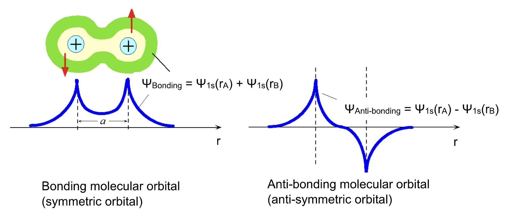
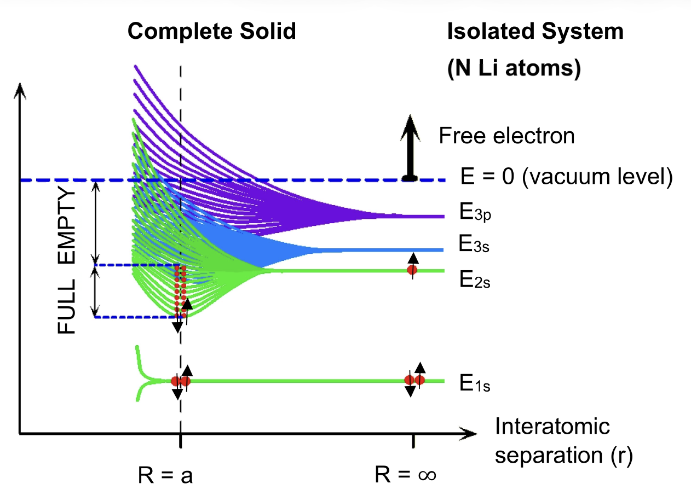
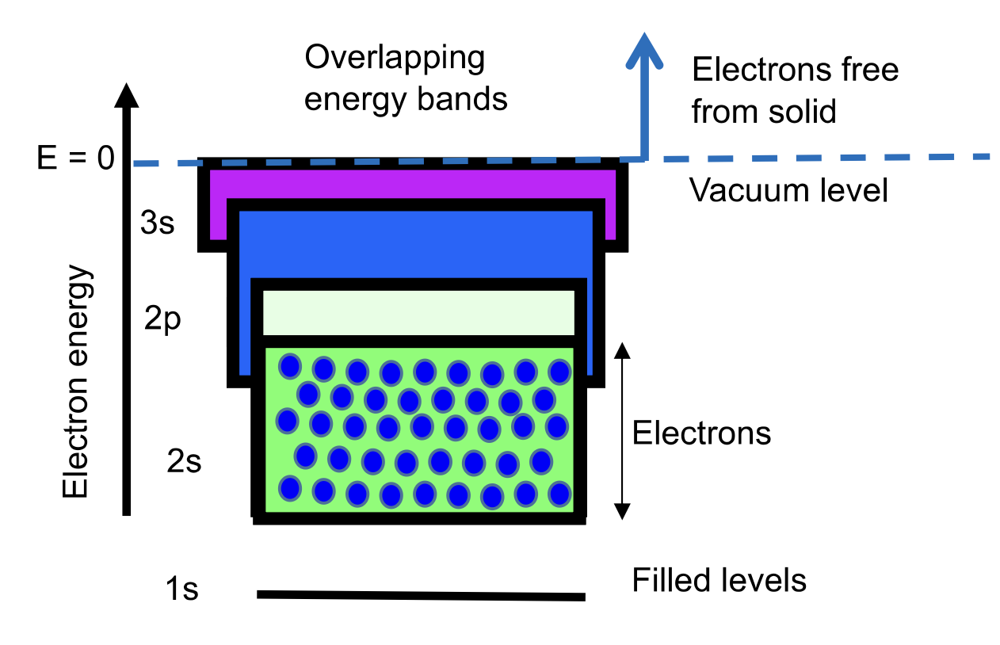
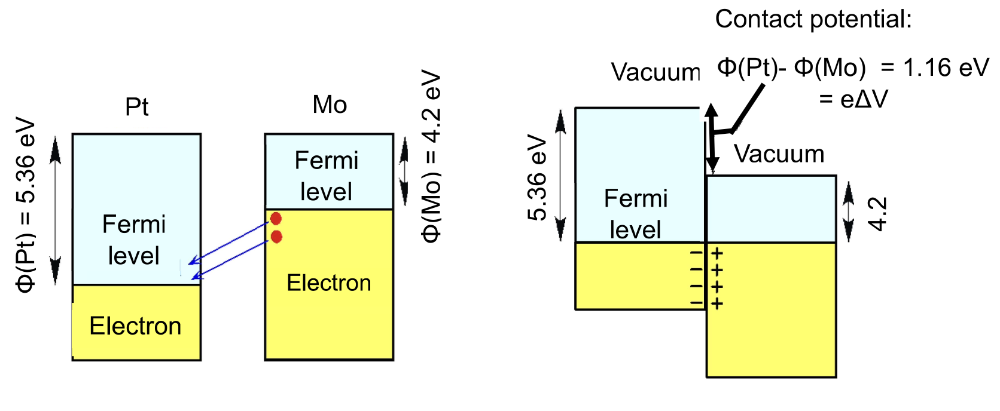
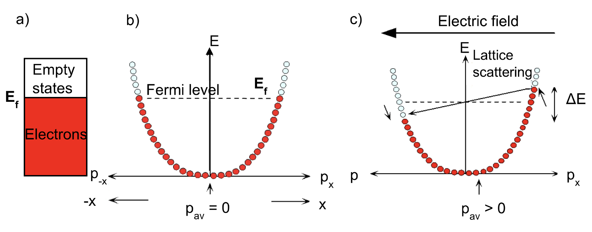
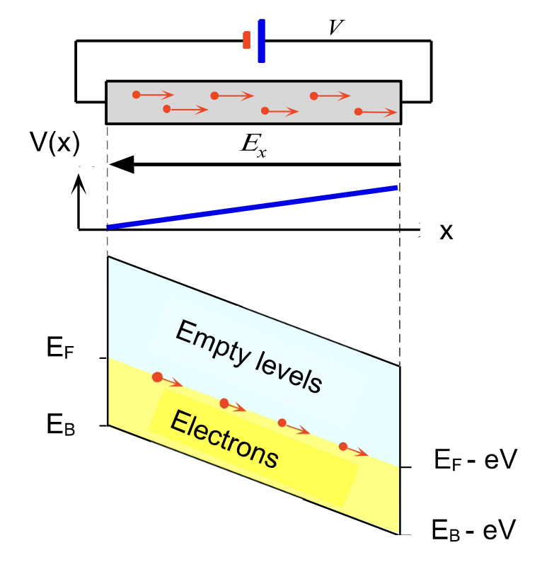
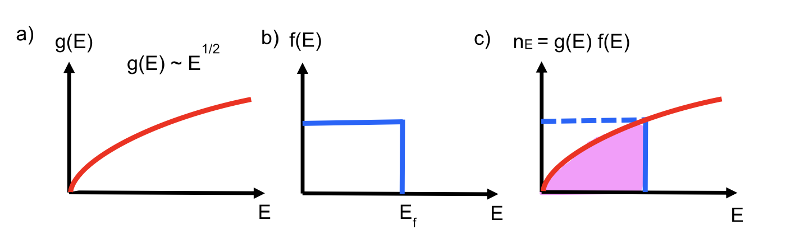
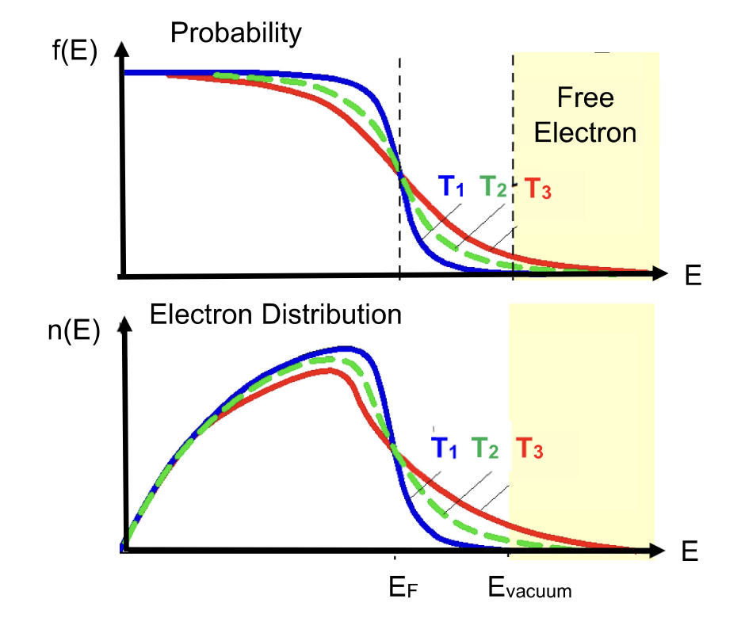

# Band Theory

For examples, see:

➡️ [Band Theory Examples](./examples.md)

---

## 1. Core Idea

Band theory explains how atomic energy levels become energy bands in solids.

```math
\text{isolated atoms}
\rightarrow
\text{orbital overlap}
\rightarrow
\text{level splitting}
\rightarrow
\text{energy bands}
\rightarrow
\text{electrical behaviour}
```

---

## 2. Wavefunction and Orbital

A wavefunction describes an electron quantum state.

```math
\psi=\text{wavefunction}
```

```math
|\psi|^2=\text{electron probability density}
```

An atomic orbital is an allowed electron state around one atom.

```math
1s,\ 2s,\ 2p,\ 3s,\dots
```

Key relation:

```math
\text{orbital is described by a wavefunction}
```

---

## 3. Isolated Hydrogen Atoms


For two isolated H atoms:

```math
R=\infty
```

Each atom has its own $begin:math:text$1s$end:math:text$ wavefunction:

```math
\psi_{1s}(r_A),\quad \psi_{1s}(r_B)
```

At $begin:math:text$R\=\\infty$end:math:text$:

```math
\text{no overlap}
\Rightarrow
\text{no bonding}
\Rightarrow
\text{no energy splitting}
```

---

## 4. Wavefunction Superposition

When atoms approach, wavefunctions overlap and combine.

Bonding combination:

```math
\psi_{\text{bonding}}=\psi_A+\psi_B
```

Anti-bonding combination:

```math
\psi_{\text{anti-bonding}}=\psi_A-\psi_B
```

The combination is done point by point in space.

---

## 5. Bonding and Anti-Bonding Orbitals



### 5.1 Bonding Orbital

```math
\psi_{\text{bonding}}=\psi_{1s}(r_A)+\psi_{1s}(r_B)
```

Meaning:

```math
\text{in phase}
\rightarrow
\text{constructive interference}
\rightarrow
\text{electron density increases between nuclei}
```

Energy:

```math
E_{\text{bonding}}<E_{1s}
```

Reason:

```math
\text{more electron density between nuclei}
\Rightarrow
\text{stronger attraction}
\Rightarrow
\text{lower energy}
```

---

### 5.2 Anti-Bonding Orbital

```math
\psi_{\text{anti-bonding}}=\psi_{1s}(r_A)-\psi_{1s}(r_B)
```

Meaning:

```math
\text{out of phase}
\rightarrow
\text{destructive interference}
\rightarrow
\text{node between nuclei}
```

At node:

```math
\psi=0
```

```math
|\psi|^2=0
```

Energy:

```math
E_{\text{anti-bonding}}>E_{1s}
```

Reason:

```math
\text{less electron density between nuclei}
\Rightarrow
\text{weaker attraction}
\Rightarrow
\text{higher energy}
```

---

## 6. Bonding vs Anti-Bonding

| Type | Formula | Phase | Between nuclei | Energy |
|---|---|---|---|---|
| Bonding | $begin:math:text$\\psi\_A\+\\psi\_B$end:math:text$ | same phase | high electron density | lower |
| Anti-bonding | $begin:math:text$\\psi\_A\-\\psi\_B$end:math:text$ | opposite phase | node / low density | higher |

---

## 7. Energy Level Splitting

Two H atoms:

```math
2\ \text{atomic orbitals}
\rightarrow
2\ \text{molecular orbitals}
```

Energy order:

```math
E_{\text{bonding}}<E_{1s}<E_{\text{anti-bonding}}
```

For $begin:math:text$H\_2$end:math:text$:

```math
2\ \text{electrons}
\rightarrow
\text{bonding orbital filled}
```

```math
\text{anti-bonding orbital empty}
```

Therefore:

```math
\text{total energy decreases}
\Rightarrow
H_2\text{ stable}
```

---

## 8. From Levels to Bands

For $begin:math:text$N$end:math:text$ atoms:

```math
N\ \text{atomic orbitals}
\rightarrow
N\ \text{split energy levels}
```

For a solid:

```math
N\sim10^{23}
```

So:

```math
\text{many closely spaced levels}
\rightarrow
\text{energy band}
```

---

## 9. Meaning of $begin:math:text$E\_\{1s\}\, E\_\{2s\}\, E\_\{2p\}$end:math:text$

```math
E_{1s}=\text{energy of electron in }1s\text{ orbital}
```

```math
E_{2s}=\text{energy of electron in }2s\text{ orbital}
```

```math
E_{2p}=\text{energy of electron in }2p\text{ orbital}
```

A horizontal line in an energy diagram means:

```math
\text{allowed electron energy level}
```

---

## 10. Lithium Band Formation



Lithium electron configuration:

```math
1s^2 2s^1
```

For $begin:math:text$N$end:math:text$ Li atoms:

```math
1\ \text{atomic level}
\rightarrow
N\ \text{closely spaced levels}
```

Each split level holds two opposite-spin electrons.

So one band has:

```math
2N\ \text{states}
```

---

### 10.1 $begin:math:text$1s$end:math:text$ Band

Each Li atom has:

```math
1s^2
```

For $begin:math:text$N$end:math:text$ atoms:

```math
2N\ \text{electrons in }1s
```

The $begin:math:text$1s$end:math:text$ band has:

```math
2N\ \text{states}
```

Therefore:

```math
1s\ \text{band full}
```

---

### 10.2 $begin:math:text$2s$end:math:text$ Band

Each Li atom has:

```math
2s^1
```

For $begin:math:text$N$end:math:text$ atoms:

```math
N\ \text{electrons in }2s
```

The $begin:math:text$2s$end:math:text$ band has:

```math
2N\ \text{states}
```

Therefore:

```math
2s\ \text{band half-filled}
```

Key result:

```math
\text{half-filled band}
\Rightarrow
\text{electrons + nearby empty states}
\Rightarrow
\text{metallic conduction}
```

---

## 11. Full and Empty Bands

Electrons fill lower energy states first.

```math
\text{low energy states}
\rightarrow
\text{filled first}
```

Full band:

```math
\text{no nearby empty states}
\Rightarrow
\text{poor conduction}
```

Partially filled band:

```math
\text{electrons and empty states available}
\Rightarrow
\text{good conduction}
```

---

## 12. Energy Bands in Metals

Metals conduct because they have either:

```math
\text{partially filled bands}
```

or:

```math
\text{overlapping bands}
```



Key rule:

```math
\text{partially filled / overlapping bands}
\Rightarrow
\text{nearby empty states}
\Rightarrow
\text{electrons can move}
\Rightarrow
\text{metallic conduction}
```

---

## 13. Vacuum Level

Vacuum level:

```math
E_{\text{vac}}
```

or sometimes:

```math
E=0
```

Meaning:

```math
\text{electron is just free from the solid}
```

If:

```math
E<E_{\text{vac}}
```

then:

```math
\text{electron is still bound in the material}
```

---

## 14. Fermi Level and Fermi Energy


At $begin:math:text$0\\\,\\text\{K\}$end:math:text$, electrons fill the lowest available states first.

Fermi level:

```math
E_F=\text{highest occupied energy level at }0\,\text{K}
```

At $begin:math:text$0\\\,\\text\{K\}$end:math:text$:

```math
E<E_F
\Rightarrow
\text{states filled}
```

```math
E>E_F
\Rightarrow
\text{states empty}
```

Fermi energy depends on the chosen reference.

Measured from band bottom:

```math
E_{F,\text{from bottom}}=E_F-E_{\text{bottom}}
```

Measured relative to vacuum level:

```math
E_{\text{vac}}-E_F
```

Key distinction:

```math
\text{Fermi level}=\text{energy position}
```

```math
\text{Fermi energy}=\text{energy difference from a reference}
```

---

### 14.1 Fermi Energy as Maximum Kinetic Energy at $begin:math:text$0\\\,\\text\{K\}$end:math:text$

In the free-electron model of metals:

```math
E=\frac{p^2}{2m_e}
```

This $begin:math:text$E$end:math:text$ is kinetic energy.

At $begin:math:text$0\\\,\\text\{K\}$end:math:text$:

```math
\text{electrons fill the lowest available kinetic-energy states}
```

not:

```math
\text{all electrons occupy the single lowest state}
```

Reason:

```math
\text{Pauli exclusion principle}
```

So:

```math
E_F=\text{maximum occupied kinetic energy at }0\,\text{K}
```

Equivalent form:

```math
E_F=\frac{p_F^2}{2m_e}
```

where $begin:math:text$p\_F$end:math:text$ is the Fermi momentum.

Key reminder:

```math
0\,\text{K}
\neq
\text{all electrons have zero kinetic energy}
```

Instead:

```math
0\,\text{K}
=
\text{no thermal excitation}
```

but electrons still fill many allowed states due to Pauli exclusion.

---

### 14.2 Why Kinetic Energy, Not Potential Energy?

For metal conduction electrons, the simple model treats them as approximately free inside the metal.

```math
\text{conduction electrons}
\approx
\text{free-electron gas}
```

So the energy spread in the $begin:math:text$E$end:math:text$-$begin:math:text$p$end:math:text$ diagram is mainly:

```math
\text{kinetic energy}
```

Potential energy is treated as a nearly constant background.

```math
PE\approx\text{constant}
```

A constant $begin:math:text$PE$end:math:text$ shifts all energies together but does not change band filling or the parabolic relation:

```math
E=\frac{p^2}{2m_e}
```

Therefore, in this context:

```math
\text{Fermi energy}
=
\text{maximum occupied kinetic energy at }0\,\text{K}
```

---

## 15. Work Function

Work function:

```math
\Phi=E_{\text{vac}}-E_F
```

Meaning:

```math
\Phi=\text{minimum energy needed to remove an electron from the metal}
```

Larger work function:

```math
\Phi\uparrow
\Rightarrow
\text{electron harder to remove}
```

Smaller work function:

```math
\Phi\downarrow
\Rightarrow
\text{electron easier to remove}
```

Key idea:

```math
\text{electron removal starts from }E_F
```

not from the bottom of the band.

---

## 16. Metal-Metal Contact and Contact Potential



When two different metals are brought into contact, electrons may transfer because their initial Fermi levels are different.

Example:

```math
\text{Mo}=\text{molybdenum}
```

```math
\text{Pt}=\text{platinum}
```

---

### 16.1 Work Functions Before Contact

```math
\Phi=E_{\text{vac}}-E_F
```

If vacuum levels are aligned before contact:

```math
\Phi(\text{Pt})>\Phi(\text{Mo})
```

then:

```math
E_F(\text{Mo})>E_F(\text{Pt})
```

For the PDF example:

```math
\Phi(\text{Pt})=5.36\ \text{eV}
```

```math
\Phi(\text{Mo})=4.2\ \text{eV}
```

Therefore:

```math
E_F(\text{Mo})>E_F(\text{Pt})
```

---

### 16.2 Electron Transfer

Electrons move from higher Fermi level to lower Fermi level:

```math
\text{Mo}\rightarrow\text{Pt}
```

So:

```math
\text{Mo loses electrons}
\Rightarrow
\text{Mo becomes positive}
```

```math
\text{Pt gains electrons}
\Rightarrow
\text{Pt becomes negative}
```

This charge separation creates a potential difference:

```math
\text{charge separation}
\rightarrow
\text{contact potential}
```

---

### 16.3 Equilibrium Condition

Electron transfer continues until the Fermi levels align.

At equilibrium:

```math
E_F(\text{Mo})=E_F(\text{Pt})
```

Key rule:

```math
\text{at equilibrium}
\Rightarrow
\text{Fermi level is flat / aligned}
```

After contact:

```math
\text{Fermi levels align}
```

but:

```math
\text{vacuum levels shift}
```

---

### 16.4 Contact Potential

Contact potential is related to the work function difference:

```math
\Phi(\text{Pt})-\Phi(\text{Mo})=e\Delta V
```

For the PDF example:

```math
\Phi(\text{Pt})-\Phi(\text{Mo})
=
5.36-4.2
=
1.16\ \text{eV}
```

So:

```math
e\Delta V=1.16\ \text{eV}
```

Since $begin:math:text$1\\\,\\text\{eV\}$end:math:text$ corresponds to one electron moving through $begin:math:text$1\\\,\\text\{V\}$end:math:text$:

```math
\Delta V=1.16\ \text{V}
```

---

### 16.5 Contact Potential Logic

```math
\text{different work functions}
\rightarrow
\text{different initial Fermi levels}
\rightarrow
\text{electron transfer}
\rightarrow
\text{charge separation}
\rightarrow
\text{contact potential}
\rightarrow
\text{Fermi level alignment}
```

---

## 17. Energy-Momentum Diagrams in Metals



For delocalised electrons in a metal:

```math
E=\frac{p^2}{2m_e}
```

where:

- $begin:math:text$E$end:math:text$: electron kinetic energy
- $begin:math:text$p$end:math:text$: electron momentum
- $begin:math:text$m\_e$end:math:text$: electron mass

Because energy depends on $begin:math:text$p\^2$end:math:text$, the $begin:math:text$E$end:math:text$-$begin:math:text$p$end:math:text$ diagram is parabolic.

---

### 17.1 Filled and Empty States

At $begin:math:text$0\\\,\\text\{K\}$end:math:text$:

```math
E<E_F
\Rightarrow
\text{states filled}
```

```math
E>E_F
\Rightarrow
\text{states empty}
```

Electrons near $begin:math:text$E\_F$end:math:text$ are important for conduction because they have nearby empty states available.

---

### 17.2 No Electric Field

Without an electric field, momentum states are filled symmetrically.

```math
+p_x
```

and:

```math
-p_x
```

states are equally occupied.

Therefore:

```math
p_{\text{av}}=0
```

So:

```math
\text{no net drift}
\Rightarrow
\text{no current}
```

Key idea:

```math
\text{symmetric momentum distribution}
\Rightarrow
\text{zero average momentum}
```

---

### 17.3 With Electric Field

When an electric field is applied, electrons experience a force:

```math
F=qE
```

For electrons:

```math
q=-e
```

Since electron charge is negative, electron force is opposite to the electric field direction.

```math
\vec{F}=q\vec{E}=-e\vec{E}
```

So if the electric field is applied in the $begin:math:text$\-x$end:math:text$ direction:

```math
\vec{E}\rightarrow -x
```

then the force on electrons is in the $begin:math:text$\+x$end:math:text$ direction:

```math
\vec{F}_e\rightarrow +x
```

Therefore electrons gain positive momentum:

```math
p_x>0
```

and the electron momentum distribution shifts toward $begin:math:text$\+p\_x$end:math:text$.

```math
\text{electric field}
\rightarrow
\text{momentum distribution shifts}
\rightarrow
p_{\text{av}}\neq0
\rightarrow
\text{current}
```

In the diagram:

```math
p_{\text{av}}>0
```

meaning electrons have net drift momentum in the $begin:math:text$\+x$end:math:text$ direction.

---

### 17.4 Energy Gain

Under an electric field, electrons can gain a small amount of energy:

```math
\Delta E
```

They move into nearby empty states above $begin:math:text$E\_F$end:math:text$.

This is why empty states near $begin:math:text$E\_F$end:math:text$ are needed for conduction.

```math
\text{nearby empty states}
\Rightarrow
\text{electron can change momentum/energy}
```

---

### 17.5 Lattice Scattering

Electrons do not accelerate forever.

They scatter from:

- lattice ions
- lattice vibrations
- defects
- impurities

This is lattice scattering.

```math
\text{electric field accelerates electrons}
```

```math
\text{lattice scattering randomises momentum}
```

Result:

```math
\text{finite drift velocity}
\rightarrow
\text{electrical resistance}
```

---

### 17.6 Key Logic

```math
\text{no electric field}
\rightarrow
\text{symmetric } +p_x \text{ and } -p_x
\rightarrow
p_{\text{av}}=0
\rightarrow
I=0
```

```math
\text{electric field applied}
\rightarrow
\text{momentum distribution shifts}
\rightarrow
p_{\text{av}}\neq0
\rightarrow
I\neq0
```

---

### 17.7 Main Takeaway

```math
\text{partially filled band}
+
\text{nearby empty states}
+
\text{electric field}
\rightarrow
\text{electron drift}
\rightarrow
\text{metallic conduction}
```

---

## 18. Electrical Conduction in Metals: Band Tilt



Applied voltage creates an electric field in the metal.

```math
\text{applied voltage}
\rightarrow
\text{electric field}
\rightarrow
\text{band tilt}
\rightarrow
\text{electron drift}
```

---

### 18.1 Electron Force

Electric force:

```math
\vec{F}=q\vec{E}
```

For electrons:

```math
q=-e
```

So:

```math
\vec{F}_e=-e\vec{E}
```

Meaning:

```math
\text{electron force is opposite to electric field}
```

If:

```math
\vec{E}\rightarrow -x
```

then:

```math
\vec{F}_e\rightarrow +x
```

So electrons drift toward $begin:math:text$\+x$end:math:text$.

---

### 18.2 Electric Potential and Electron Energy

Electric potential varies with position:

```math
V=V(x)
```

Electron potential energy:

```math
U=qV=-eV
```

Key sign:

```math
V\uparrow
\Rightarrow
U_e\downarrow
```

So if $begin:math:text$V\(x\)$end:math:text$ increases toward $begin:math:text$\+x$end:math:text$:

```math
\text{electron energy decreases toward }+x
```

---

### 18.3 Band Tilt

Because electron energy depends on $begin:math:text$V\(x\)$end:math:text$:

```math
E\rightarrow E-eV
```

So at the right side:

```math
E_F\rightarrow E_F-eV
```

```math
E_B\rightarrow E_B-eV
```

Meaning:

```math
\text{higher electric potential}
\Rightarrow
\text{lower electron energy}
```

Therefore the band slopes downward toward $begin:math:text$\+x$end:math:text$.

---

### 18.4 Electron Drift Direction

Electrons move toward lower electron energy.

```math
\text{band slopes down to }+x
\Rightarrow
\text{electrons drift to }+x
```

Same result as force view:

```math
\vec{E}\rightarrow -x
\Rightarrow
\vec{F}_e\rightarrow +x
\Rightarrow
e^-\text{ drift }+x
```

---

### 18.5 Main Logic

```math
V(x)\uparrow\text{ toward }+x
```

```math
U_e=-eV
```

```math
U_e\downarrow\text{ toward }+x
```

```math
\text{bands tilt downward toward }+x
```

```math
\text{electrons drift toward }+x
```

---

### 18.6 Key Reminder

```math
\vec{F}_e=-e\vec{E}
```

```math
U_e=-eV
```

Both negative signs come from:

```math
\text{electron has negative charge}
```

---

## 19. Filling Up Energy Bands in Metals



This section asks:

```math
\text{how many electrons exist at each energy?}
```

Main relation:

```math
n_E=g(E)f(E)
```

where:

- $begin:math:text$g\(E\)$end:math:text$: density of states
- $begin:math:text$f\(E\)$end:math:text$: Fermi-Dirac distribution
- $begin:math:text$n\_E$end:math:text$: electron concentration per unit energy

---

### 19.1 Density of States $begin:math:text$g\(E\)$end:math:text$

Density of states:

```math
g(E)=\text{number of available states at energy }E
```

Analogy:

```math
g(E)=\text{number of available seats}
```

For free electrons in a metal:

```math
g(E)\propto E^{1/2}
```

Meaning:

```math
E\uparrow
\Rightarrow
g(E)\uparrow
```

Higher energy gives more available states.

---

### 19.2 Fermi-Dirac Distribution $begin:math:text$f\(E\)$end:math:text$

Fermi-Dirac distribution:

```math
f(E)=\text{probability that a state at energy }E\text{ is occupied}
```

Range:

```math
0\le f(E)\le1
```

At $begin:math:text$T\=0\\\,\\text\{K\}$end:math:text$:

```math
E<E_F
\Rightarrow
f(E)=1
```

```math
E>E_F
\Rightarrow
f(E)=0
```

Meaning:

```math
\text{below }E_F:\text{ filled}
```

```math
\text{above }E_F:\text{ empty}
```

At $begin:math:text$T\=0\\\,\\text\{K\}$end:math:text$, $begin:math:text$f\(E\)$end:math:text$ is a sharp step function at $begin:math:text$E\_F$end:math:text$.

---

### 19.3 Electron Concentration per Unit Energy $begin:math:text$n\_E$end:math:text$

Electron concentration per unit energy:

```math
n_E=g(E)f(E)
```

Meaning:

```math
\text{actual electrons}
=
\text{available states}
\times
\text{occupation probability}
```

Analogy:

```math
\text{occupied seats}
=
\text{available seats}
\times
\text{probability of being occupied}
```

---

### 19.4 Difference Between $begin:math:text$n\_E$end:math:text$, $begin:math:text$n\_EdE$end:math:text$, and $begin:math:text$n$end:math:text$

$begin:math:text$n\_E$end:math:text$:

```math
n_E=\text{electron concentration per unit energy at energy }E
```

Small energy range:

```math
E\text{ to }E+dE
```

Electrons in that range:

```math
n_EdE
```

Total electron concentration:

```math
n=\int n_E\,dE
```

Analogy:

| Symbol | Meaning | Analogy |
|---|---|---|
| $begin:math:text$n\_E$end:math:text$ | electrons per unit energy at $begin:math:text$E$end:math:text$ | people density on one floor |
| $begin:math:text$n\_EdE$end:math:text$ | electrons in small energy range | people in a small floor slice |
| $begin:math:text$n$end:math:text$ | total electron concentration | total people in the building |

---

### 19.5 Diagram b and c at $begin:math:text$T\=0\\\,\\text\{K\}$end:math:text$

Diagram b is $begin:math:text$f\(E\)$end:math:text$ at $begin:math:text$T\=0\\\,\\text\{K\}$end:math:text$:

```math
E<E_F
\Rightarrow
f(E)=1
```

```math
E>E_F
\Rightarrow
f(E)=0
```

Diagram c is $begin:math:text$n\_E\=g\(E\)f\(E\)$end:math:text$ at $begin:math:text$T\=0\\\,\\text\{K\}$end:math:text$.

For $begin:math:text$E\<E\_F$end:math:text$:

```math
f(E)=1
```

so:

```math
n_E=g(E)
```

For $begin:math:text$E\>E\_F$end:math:text$:

```math
f(E)=0
```

so:

```math
n_E=0
```

Therefore:

```math
n_E
\text{ follows }g(E)\text{ below }E_F
```

and:

```math
n_E
\text{ cuts off at }E_F
```

---

### 19.6 Fermi-Dirac Distribution Above $begin:math:text$0\\\,\\text\{K\}$end:math:text$



At $begin:math:text$T\>0\\\,\\text\{K\}$end:math:text$, thermal energy excites some electrons above $begin:math:text$E\_F$end:math:text$.

So the sharp step becomes broadened around $begin:math:text$E\_F$end:math:text$.

```math
T=0\,\text{K}
\Rightarrow
\text{sharp step}
```

```math
T>0\,\text{K}
\Rightarrow
\text{broadened step}
```

At $begin:math:text$T\>0\\\,\\text\{K\}$end:math:text$:

```math
E<E_F
\Rightarrow
f(E)\text{ slightly less than }1\text{ near }E_F
```

```math
E>E_F
\Rightarrow
f(E)\text{ non-zero near }E_F
```

Higher temperature:

```math
T\uparrow
\Rightarrow
\text{broader transition around }E_F
```

---

### 19.7 Fermi-Dirac Formula

Fermi-Dirac distribution:

```math
f(E)=\frac{1}{1+e^{(E-E_F)/(k_BT)}}
```

where:

- $begin:math:text$E$end:math:text$: electron energy
- $begin:math:text$E\_F$end:math:text$: Fermi energy / Fermi level
- $begin:math:text$k\_B$end:math:text$: Boltzmann constant
- $begin:math:text$T$end:math:text$: temperature

At $begin:math:text$E\=E\_F$end:math:text$:

```math
f(E_F)=\frac{1}{2}
```

Meaning:

```math
\text{state at }E_F\text{ has 50 percent occupation probability}
```

For $begin:math:text$E\<E\_F$end:math:text$:

```math
f(E)\approx1
```

For $begin:math:text$E\>E\_F$end:math:text$:

```math
f(E)\approx0
```

---

### 19.8 Total Electron Concentration

Total valence electron concentration:

```math
n=\int_0^{\text{top of band}} n_E\,dE
```

Since:

```math
n_E=g(E)f(E)
```

then:

```math
n=\int_0^{\text{top of band}} g(E)f(E)\,dE
```

Meaning:

```math
\text{total electrons}
=
\text{sum of electrons over all energies}
```

---

### 19.9 Average Electron Energy

Average electron energy:

```math
E_{\text{average}}
=
\frac{\int E n_E\,dE}{n}
```

Meaning:

```math
\text{weighted average of electron energies}
```

At $begin:math:text$0\\\,\\text\{K\}$end:math:text$, for the free-electron metal model:

```math
E_{\text{average}}\approx\frac{3}{5}E_F
```

Meaning:

```math
E_F=\text{highest occupied energy}
```

```math
E_{\text{average}}=\text{average of all occupied electron energies}
```

So:

```math
E_{\text{average}}<E_F
```

---

### 19.10 Why This Matters for Conduction

Conduction mainly involves electrons near $begin:math:text$E\_F$end:math:text$.

Deep below $begin:math:text$E\_F$end:math:text$:

```math
\text{states filled}
\Rightarrow
\text{few nearby empty states}
```

Near $begin:math:text$E\_F$end:math:text$:

```math
\text{filled states below}
+
\text{empty states above}
```

So:

```math
\text{electrons near }E_F
\Rightarrow
\text{main conduction electrons}
```

---

### 19.11 Key Summary

```math
g(E)=\text{available states}
```

```math
f(E)=\text{occupation probability}
```

```math
n_E=g(E)f(E)=\text{actual electron distribution}
```

```math
n=\int n_E\,dE=\text{total electron concentration}
```

```math
E_{\text{average}}=\frac{\int E n_E\,dE}{n}
```

At $begin:math:text$T\=0\\\,\\text\{K\}$end:math:text$:

```math
n_E=g(E)\quad \text{below }E_F
```

```math
n_E=0\quad \text{above }E_F
```

At $begin:math:text$T\>0\\\,\\text\{K\}$end:math:text$:

```math
f(E)\text{ broadens around }E_F
```

---

## 20. Link to Solids

In crystals:

```math
\text{periodic atoms}
\rightarrow
\text{periodic potential}
\rightarrow
\text{allowed energy bands}
```

Band structure determines:

- metal
- semiconductor
- insulator