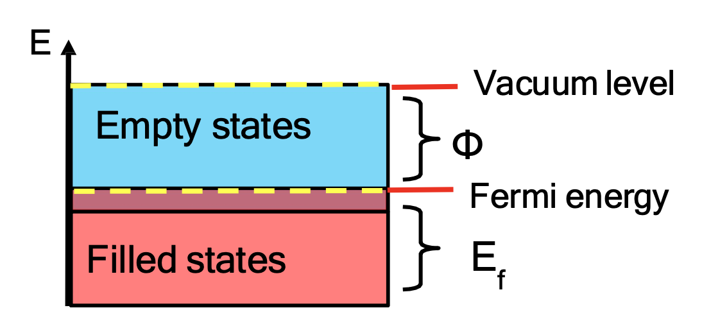
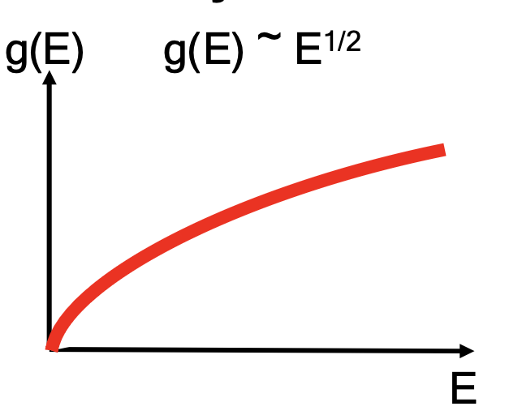
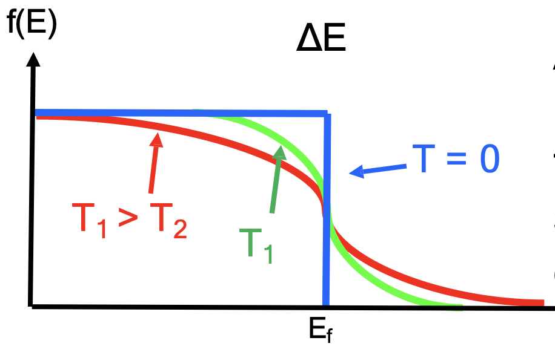
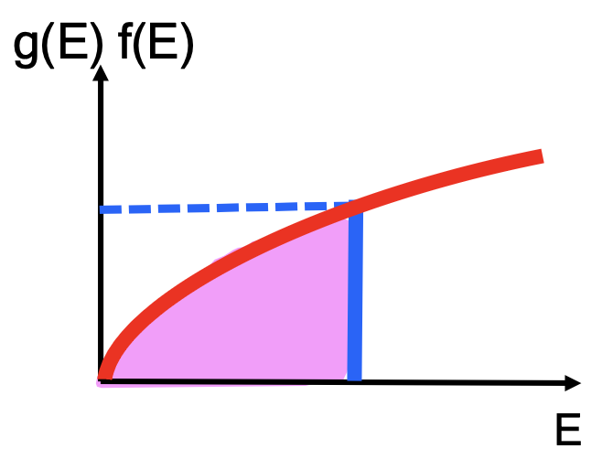
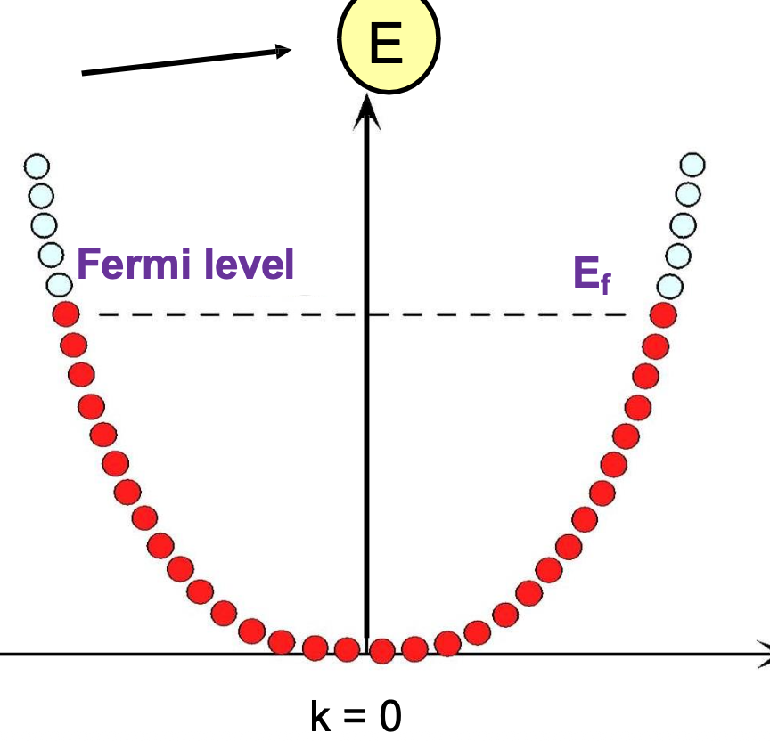
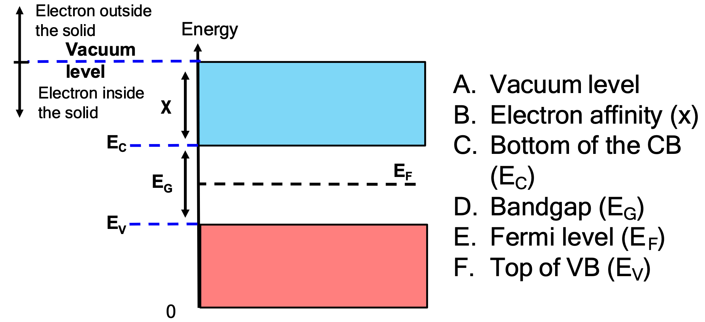

# Band Theory

For worked examples, see:

➡️ [Band Theory Examples](./examples.md)

---

## 1. Energy Bands in Solids

When atoms are isolated, electrons occupy discrete atomic energy levels.

When many atoms form a solid:

```math
\text{atomic orbitals overlap}
\rightarrow
\text{energy levels split}
\rightarrow
\text{energy bands form}
```

For $begin:math:text$N$end:math:text$ atoms:

```math
N\ \text{atomic orbitals}
\rightarrow
N\ \text{closely spaced energy levels}
```

Including spin:

```math
N\ \text{orbitals}
\rightarrow
2N\ \text{electron states}
```

Key reason:

```math
\text{Pauli exclusion principle}
\Rightarrow
\text{electrons cannot all occupy the same state}
```

---

## 2. Metals and Partially Filled Bands

In metals, energy bands are either:

```math
\text{partially filled}
```

or:

```math
\text{overlapping}
```

This means there are:

```math
\text{filled states}
+
\text{nearby empty states}
```

So electrons can move under an electric field.

```math
\text{nearby empty states}
\Rightarrow
\text{electron motion}
\Rightarrow
\text{electrical conduction}
```

For example, in a half-filled band:

```math
N\ \text{electrons}
```

occupy:

```math
2N\ \text{available states}
```

Therefore:

```math
\text{band partially filled}
\Rightarrow
\text{metallic conduction}
```

---

## 3. Vacuum Level, Fermi Energy and Work Function



Vacuum level:

```math
E_{\text{vac}}
```

Meaning:

```math
E_{\text{vac}}=\text{energy of an electron just free from the solid}
```

Fermi energy / Fermi level:

```math
E_F
```

At $begin:math:text$0K$end:math:text$:

```math
E_F=\text{highest occupied electron energy}
```

Work function:

```math
\Phi=E_{\text{vac}}-E_F
```

Meaning:

```math
\Phi=\text{minimum energy needed to release an electron from a metal}
```

Short memory:

```math
\Phi=\text{escape energy from }E_F\text{ to vacuum}
```

Larger work function:

```math
\Phi\uparrow
\Rightarrow
\text{electron harder to remove}
```

Smaller work function:

```math
\Phi\downarrow
\Rightarrow
\text{electron easier to remove}
```

---

## 4. Fermi Energy and Metal Conduction

In a metal:

```math
E_F\text{ lies inside an allowed band}
```

This means:

```math
E<E_F
\Rightarrow
\text{filled states}
```

```math
E>E_F
\Rightarrow
\text{empty states}
```

So near $begin:math:text$E\_F$end:math:text$, there are electrons and nearby empty states.

```math
\text{occupied states near }E_F
+
\text{nearby empty states}
\Rightarrow
\text{electrons can move}
```

Therefore:

```math
\text{Fermi level inside a band}
\Rightarrow
\text{metal conducts}
```

---

## 5. Density of States



Density of states:

```math
g(E)=\text{number of available electron states per unit energy}
```

For free-electron-like metals:

```math
g(E)\propto E^{1/2}
```

Meaning:

```math
E\uparrow
\Rightarrow
g(E)\uparrow
```

So at higher energy, there are more available states.

Short memory:

```math
g(E)=\text{available seats for electrons}
```

---

## 6. Fermi-Dirac Distribution



Fermi-Dirac distribution:

```math
f(E)=\text{probability that a state at energy }E\text{ is occupied}
```

Formula:

```math
f(E)=\frac{1}{1+e^{(E-E_F)/(k_BT)}}
```

At $begin:math:text$T\=0K$end:math:text$:

```math
E<E_F
\Rightarrow
f(E)=1
```

```math
E>E_F
\Rightarrow
f(E)=0
```

So at $begin:math:text$0K$end:math:text$, the graph is a sharp step.

At $begin:math:text$T\>0K$end:math:text$:

```math
\text{sharp step}
\rightarrow
\text{broadened transition around }E_F
```

Higher temperature:

```math
T\uparrow
\Rightarrow
\text{broader Fermi-Dirac curve}
```

---

## 7. Electron Distribution



Actual electron distribution:

```math
n_E=g(E)f(E)
```

Meaning:

```math
\text{actual electrons}
=
\text{available states}
\times
\text{occupation probability}
```

So:

```math
g(E)=\text{available states}
```

```math
f(E)=\text{probability of occupation}
```

```math
n_E=\text{actual occupied states}
```

Total electron concentration:

```math
n=\int g(E)f(E)\,dE
```

At $begin:math:text$0K$end:math:text$:

```math
E<E_F
\Rightarrow
n_E=g(E)
```

```math
E>E_F
\Rightarrow
n_E=0
```

---

## 8. Energy-Momentum / E-k Diagram



An $begin:math:text$E\-k$end:math:text$ diagram shows:

```math
\text{electron energy }E
\quad \text{vs}
\quad \text{wave vector }k
```

Crystal momentum:

```math
p=\hbar k
```

Electron kinetic energy:

```math
E=\frac{p^2}{2m_e^*}
```

Using $begin:math:text$p\=\\hbar k$end:math:text$:

```math
E=\frac{\hbar^2k^2}{2m_e^*}
```

So the $begin:math:text$E\-k$end:math:text$ curve is often parabolic.

The red dots are:

```math
\text{filled states}
```

The empty circles are:

```math
\text{empty states}
```

The dashed line is:

```math
E_F=\text{Fermi level}
```

---

## 9. Effective Mass

Effective mass:

```math
m^*=\text{apparent mass of a carrier inside a crystal}
```

It describes:

```math
\text{how easily an electron or hole accelerates under an applied force}
```

Effective mass is determined by the curvature of the $begin:math:text$E\-k$end:math:text$ diagram:

```math
m^*=\frac{\hbar^2}{d^2E/dk^2}
```

where:

```math
\frac{d^2E}{dk^2}
=
\text{curvature of the }E-k\text{ diagram}
```

Large curvature:

```math
\frac{d^2E}{dk^2}\uparrow
\Rightarrow
m^*\downarrow
```

Flat band:

```math
\frac{d^2E}{dk^2}\downarrow
\Rightarrow
m^*\uparrow
```

Key result:

```math
m^*\downarrow
\Rightarrow
\mu\uparrow
\Rightarrow
\sigma\uparrow
```

Effective mass is often written as:

```math
m_e^*=\alpha m_e
```

where:

- $begin:math:text$m\_e\^\*$end:math:text$: electron effective mass
- $begin:math:text$m\_e$end:math:text$: free electron mass
- $begin:math:text$\\alpha$end:math:text$: dimensionless constant

---

## 10. Holes

A hole is:

```math
\text{missing electron in the valence band}
```

It behaves like:

```math
\text{positive mobile charge carrier}
```

Formation:

```math
\text{electron leaves valence band}
\Rightarrow
\text{empty state remains}
\Rightarrow
\text{hole}
```

Hole effective mass:

```math
m_h^*=\frac{\hbar^2}{d^2E/dk^2}
```

In semiconductors:

```math
\text{current}
=
\text{electron current}
+
\text{hole current}
```

---

## 11. Semiconductor Energy Band Diagram



Important energy levels:

```math
E_{\text{vac}}=\text{vacuum level}
```

```math
E_C=\text{bottom of conduction band}
```

```math
E_V=\text{top of valence band}
```

```math
E_F=\text{Fermi level}
```

Bandgap:

```math
E_g=E_C-E_V
```

Electron affinity:

```math
\chi=E_{\text{vac}}-E_C
```

Work function:

```math
\Phi=E_{\text{vac}}-E_F
```

---

## 12. Bandgap

Bandgap:

```math
E_g=E_C-E_V
```

Meaning:

```math
E_g=\text{energy needed to excite an electron from valence band to conduction band}
```

Small bandgap:

```math
E_g\downarrow
\Rightarrow
\text{more thermally excited carriers}
\Rightarrow
\text{higher conductivity}
```

Large bandgap:

```math
E_g\uparrow
\Rightarrow
\text{fewer carriers}
\Rightarrow
\text{lower conductivity}
```

---

## 13. Electron Affinity vs Work Function

Electron affinity:

```math
\chi=E_{\text{vac}}-E_C
```

Work function:

```math
\Phi=E_{\text{vac}}-E_F
```

Difference:

| Quantity | Formula | Uses | Meaning |
|---|---|---|---|
| Electron affinity | $begin:math:text$\\chi\=E\_\{\\text\{vac\}\}\-E\_C$end:math:text$ | conduction band edge $begin:math:text$E\_C$end:math:text$ | energy from $begin:math:text$E\_C$end:math:text$ to vacuum |
| Work function | $begin:math:text$\\Phi\=E\_\{\\text\{vac\}\}\-E\_F$end:math:text$ | Fermi level $begin:math:text$E\_F$end:math:text$ | energy from $begin:math:text$E\_F$end:math:text$ to vacuum |

Key memory:

```math
\chi\text{ uses }E_C
```

```math
\Phi\text{ uses }E_F
```

Doping changes $begin:math:text$E\_F$end:math:text$, so it changes $begin:math:text$\\Phi$end:math:text$.

Electron affinity is usually treated as a material property.

---

## 14. Metal, Semiconductor and Insulator Comparison

| Feature | Metal | Semiconductor | Insulator |
|---|---|---|---|
| Band structure | partially filled band or overlapping bands | full valence band + small bandgap | full valence band + large bandgap |
| Fermi level | inside an allowed band | inside bandgap | inside large bandgap |
| Bandgap | no effective gap | small, typically around $begin:math:text$1\\ \\text\{eV\}$end:math:text$ | large, often several eV |
| Empty states near filled states | yes | only after thermal excitation | almost none |
| Main carriers | electrons | electrons and holes | almost no mobile carriers |
| Conductivity | high | moderate / controllable | very low |
| Temperature effect | $begin:math:text$T\\uparrow \\Rightarrow \\rho\\uparrow$end:math:text$ | $begin:math:text$T\\uparrow \\Rightarrow n\,p\\uparrow\\Rightarrow\\sigma\\uparrow$end:math:text$ | remains very low |
| Example | Cu, Al, Au | Si, Ge, GaAs | glass, diamond, SiO$begin:math:text$\_2$end:math:text$ |

---

## 15. Exam-Safe Summary

Metal conduction:

```math
\text{partially filled / overlapping band}
\Rightarrow
\text{nearby empty states}
\Rightarrow
\text{electrons move}
\Rightarrow
\text{high conductivity}
```

Semiconductor conduction:

```math
\text{small bandgap}
\Rightarrow
\text{thermal excitation}
\Rightarrow
e^-+h^+
\Rightarrow
\text{moderate conductivity}
```

Insulator:

```math
\text{large bandgap}
\Rightarrow
\text{almost no carriers}
\Rightarrow
\text{very low conductivity}
```

Effective mass:

```math
\text{more curved }E-k\text{ band}
\Rightarrow
m^*\downarrow
\Rightarrow
\mu\uparrow
\Rightarrow
\sigma\uparrow
```

Work function:

```math
\Phi=E_{\text{vac}}-E_F
```

Electron affinity:

```math
\chi=E_{\text{vac}}-E_C
```

Bandgap:

```math
E_g=E_C-E_V
```