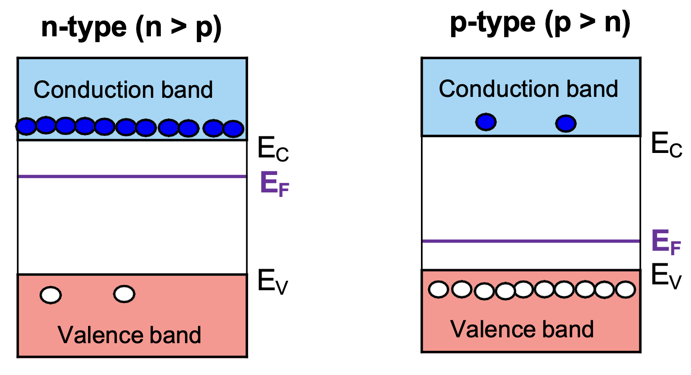
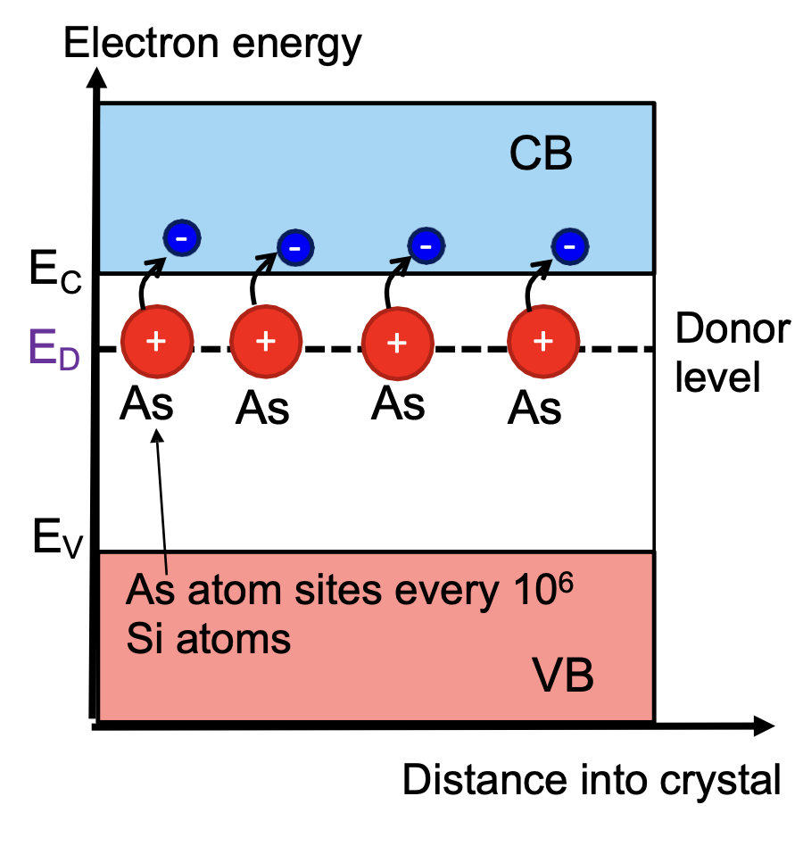
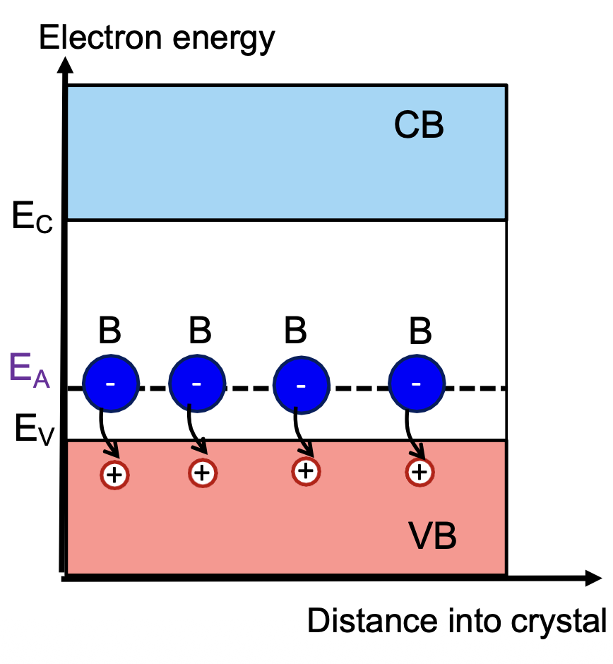

# Electrical and Thermal Conduction in Solids

For worked examples, see:

➡️ [Conductivity Examples](./examples.md)

---

## 1. Core Idea

Electrical conduction:

```math
\text{applied electric field}
\rightarrow
\text{charge motion}
\rightarrow
\text{current}
```

Thermal conduction:

```math
\text{temperature difference}
\rightarrow
\text{heat flow}
```

Semiconductor conduction:

```math
\text{electron in conduction band}
+
\text{hole in valence band}
\rightarrow
\text{current}
```

---

# Part A: Basic Electrical and Thermal Conduction

## 2. Electrical Conduction

Electrical conduction means:

```math
\text{motion of charges due to an applied electric field}
```

For electrons:

```math
F=-eE
```

Meaning:

```math
\text{electron force is opposite to electric field direction}
```

---

## 3. Current Density and Conductivity

Current density:

```math
J=\frac{I}{A}
```

Material form of Ohm's law:

```math
J=\sigma E
```

where:

- `J`: current density, A m^-2
- `I`: current, A
- `A`: cross-sectional area, m^2
- `sigma`: electrical conductivity, S m^-1
- `E`: electric field, V m^-1

Meaning:

```math
\sigma\uparrow
\Rightarrow
\text{same electric field gives larger current density}
```

---

## 4. Resistivity and Conductivity

Conductivity and resistivity are inverses:

```math
\sigma=\frac{1}{\rho}
```

where:

- `sigma`: electrical conductivity, S m^-1
- `rho`: electrical resistivity, ohm m

Therefore:

```math
\rho\uparrow
\Rightarrow
\sigma\downarrow
```

```math
\sigma\uparrow
\Rightarrow
\rho\downarrow
```

---

## 5. Resistance of a Wire

For a uniform wire:

```math
R=\rho\frac{L}{A}
```

where:

- `R`: resistance
- `rho`: resistivity
- `L`: length
- `A`: cross-sectional area

Key trends:

```math
L\uparrow
\Rightarrow
R\uparrow
```

```math
A\uparrow
\Rightarrow
R\downarrow
```

---

## 6. Useful Formula When Electric Field Is Given

From:

```math
J=\sigma E
```

and:

```math
\sigma=\frac{1}{\rho}
```

we get:

```math
J=\frac{E}{\rho}
```

Since:

```math
I=JA
```

then:

```math
I=\frac{EA}{\rho}
```

Use this when the question gives:

```math
E,\quad A,\quad \rho
```

instead of length.

---

## 7. Thermal Conduction

Thermal conduction means:

```math
\text{heat transfer through a material from hot to cold}
```

Steady-state heat conduction:

```math
\Delta Q=-A\kappa\frac{\delta T}{\delta x}
```

where:

- `Delta Q`: heat transfer rate / thermal power, W
- `A`: cross-sectional area
- `kappa`: thermal conductivity, W m^-1 K^-1
- `T`: temperature
- `x`: distance

The negative sign means:

```math
\text{heat flows from hot to cold}
```

---

## 8. Heat Transfer Mechanisms

In metals:

```math
\text{heat transfer mainly by conduction electrons}
```

In insulators:

```math
\text{heat transfer mainly by lattice vibrations}
```

Lattice vibrations are called:

```math
\text{phonons}
```

---

# Part B: Drude Model

## 9. Drude Model for Metal Conduction

Drude model explains metal conduction by treating electrons as free carriers moving through a metal lattice.

Core idea:

```math
\text{electric field}
\rightarrow
\text{electron drift}
\rightarrow
\text{current}
```

However, electrons are scattered by the lattice.

```math
\text{accelerate}
\rightarrow
\text{collision}
\rightarrow
\text{randomised motion}
\rightarrow
\text{accelerate again}
```

---

## 10. Key Quantities

| Symbol | Meaning | Unit |
|---|---|---|
| `n` | free electron concentration | m^-3 |
| `e` | electron charge magnitude | C |
| `E` | electric field | V m^-1 |
| `v_drift` | average drift velocity | m s^-1 |
| `mu_drift` | drift mobility | m^2 V^-1 s^-1 |
| `sigma` | electrical conductivity | S m^-1 |
| `rho` | electrical resistivity | ohm m |
| `tau` | scattering time | s |
| `m_e` | electron mass | kg |
| `m*` | effective mass | kg |

---

## 11. Drift Velocity

Drift velocity:

```math
v_{\text{drift}}=\text{average carrier velocity caused by an electric field}
```

It is not the random thermal speed of electrons.

```math
\text{random electron speed}
\neq
v_{\text{drift}}
```

Random motion is large but gives no net current.

```math
\text{net average drift}
\Rightarrow
\text{current}
```

---

## 12. Drift Mobility

Drift mobility:

```math
\mu_{\text{drift}}=\text{how easily electrons drift under an electric field}
```

Definition:

```math
v_{\text{drift}}=\mu_{\text{drift}}E
```

So:

```math
\mu_{\text{drift}}=\frac{v_{\text{drift}}}{E}
```

Unit:

```math
\mu_{\text{drift}}:\ \text{m}^2\text{V}^{-1}\text{s}^{-1}
```

or:

```math
\mu_{\text{drift}}:\ \text{cm}^2\text{V}^{-1}\text{s}^{-1}
```

Conversion:

```math
1\ \text{m}^2\text{V}^{-1}\text{s}^{-1}
=
10^4\ \text{cm}^2\text{V}^{-1}\text{s}^{-1}
```

Meaning:

```math
\mu_{\text{drift}}\uparrow
\Rightarrow
\text{larger drift velocity for the same electric field}
```

---

## 13. Current Density from Electron Motion

Current density from carrier motion:

```math
J=ne v_{\text{drift}}
```

Meaning:

```math
\text{more free electrons}
\Rightarrow
J\uparrow
```

```math
\text{larger drift velocity}
\Rightarrow
J\uparrow
```

Material Ohm's law:

```math
J=\sigma E
```

Therefore:

```math
ne v_{\text{drift}}=\sigma E
```

This links microscopic electron motion to macroscopic conductivity.

---

## 14. Conductivity from Drude Model

Using:

```math
v_{\text{drift}}=\mu_{\text{drift}}E
```

in:

```math
J=ne v_{\text{drift}}
```

gives:

```math
J=ne\mu_{\text{drift}}E
```

Compare with:

```math
J=\sigma E
```

Therefore:

```math
\sigma=ne\mu_{\text{drift}}
```

Since:

```math
\sigma=\frac{1}{\rho}
```

we also have:

```math
\sigma=ne\mu_{\text{drift}}=\frac{1}{\rho}
```

---

## 15. Scattering Time

Scattering time:

```math
\tau=\text{average time between electron collisions}
```

Large scattering time:

```math
\tau\uparrow
\Rightarrow
\text{fewer collisions}
\Rightarrow
\text{electrons move more easily}
```

Small scattering time:

```math
\tau\downarrow
\Rightarrow
\text{more collisions}
\Rightarrow
\text{electrons move less easily}
```

Physical picture:

```math
\text{long }\tau
\Rightarrow
\text{longer free motion before collision}
```

```math
\text{short }\tau
\Rightarrow
\text{more frequent scattering}
```

---

## 16. Drude Mobility and Conductivity

Drude mobility:

```math
\mu_{\text{drift}}=\frac{e\tau}{m^*}
```

If free electron mass is used:

```math
m^*=m_e
```

then:

```math
\mu_{\text{drift}}=\frac{e\tau}{m_e}
```

Drude conductivity:

```math
\sigma=ne\mu_{\text{drift}}
```

Substitute mobility:

```math
\sigma=\frac{ne^2\tau}{m^*}
```

or, using free electron mass:

```math
\sigma=\frac{ne^2\tau}{m_e}
```

Key trends:

```math
n\uparrow
\Rightarrow
\sigma\uparrow
```

```math
\tau\uparrow
\Rightarrow
\mu_{\text{drift}}\uparrow
\Rightarrow
\sigma\uparrow
```

```math
m^*\downarrow
\Rightarrow
\mu_{\text{drift}}\uparrow
\Rightarrow
\sigma\uparrow
```

---

## 17. Drude Model Assumptions

- Electrons move in straight lines between collisions.
- Collisions with atoms or ions are instantaneous and random.
- Scattering time is independent of electron position and velocity.
- Electrons reach thermal equilibrium by collisions with the lattice.
- The electric field is uniform.
- Electrons do not interact with each other.

Exam-safe summary:

```math
\text{Drude model}
=
\text{free electrons}
+
\text{electric-field drift}
+
\text{random lattice scattering}
```

---

# Part C: Temperature Dependence in Metals

## 18. Temperature and Scattering

In metals, increasing temperature increases lattice vibrations.

```math
T\uparrow
\Rightarrow
\text{lattice vibration}\uparrow
\Rightarrow
\text{electron scattering}\uparrow
```

Therefore:

```math
T\uparrow
\Rightarrow
\tau\downarrow
```

The slide assumes:

```math
\tau\propto\frac{1}{T}
```

or:

```math
\tau=\frac{C}{T}
```

where:

```math
C=\text{temperature-independent constant}
```

---

## 19. Mobility vs Temperature

Drude mobility:

```math
\mu_{\text{drift}}=\frac{e\tau}{m_e}
```

Using:

```math
\tau=\frac{C}{T}
```

gives:

```math
\mu_{\text{drift}}=\frac{eC}{m_eT}
```

Therefore:

```math
\mu_{\text{drift}}\propto\frac{1}{T}
```

Meaning:

```math
T\uparrow
\Rightarrow
\mu_{\text{drift}}\downarrow
```

---

## 20. Drift Resistivity

Drift resistivity:

```math
\rho_{\text{drift}}=\frac{1}{ne\mu_{\text{drift}}}
```

Meaning:

```math
\rho_{\text{drift}}
=
\text{resistivity caused by limited electron drift mobility}
```

Using:

```math
\mu_{\text{drift}}=\frac{eC}{m_eT}
```

gives:

```math
\rho_{\text{drift}}
=
\frac{m_eT}{e^2nC}
```

Since electron mass, electron charge, electron concentration, and `C` are constants:

```math
\rho_{\text{drift}}\propto T
```

---

## 21. Temperature-Dependent Resistivity

Temperature-dependent resistivity:

```math
\rho_T=\text{temperature-dependent part of resistivity}
```

It comes mainly from lattice vibration scattering.

For lattice-scattering-limited metals:

```math
\rho_T=AT
```

where:

- `rho_T`: temperature-dependent resistivity
- `A`: temperature-independent constant
- `T`: temperature

Here:

```math
A=\frac{m_e}{e^2nC}
```

Important:

```math
A\neq\text{cross-sectional area}
```

In this equation, `A` is just a proportionality constant.

---

## 22. Relationship Between Drift Resistivity and Temperature Resistivity

General drift resistivity:

```math
\rho_{\text{drift}}=\frac{1}{ne\mu_{\text{drift}}}
```

Temperature-dependent resistivity:

```math
\rho_T=\text{part of resistivity caused by temperature-dependent lattice scattering}
```

If lattice scattering is the main scattering mechanism:

```math
\rho_{\text{drift}}\approx\rho_T
```

So on this slide:

```math
\rho_{\text{drift}}\approx\rho_T=AT
```

In real metals, total resistivity can be written as:

```math
\rho=\rho_0+\rho_T
```

where:

```math
\rho_0=\text{residual resistivity from defects and impurities}
```

```math
\rho_T=\text{temperature-dependent resistivity from lattice vibrations}
```

---

## 23. Temperature Dependence Exam Summary

Main chain:

```math
T\uparrow
\Rightarrow
\text{lattice vibration}\uparrow
\Rightarrow
\text{electron scattering}\uparrow
\Rightarrow
\tau\downarrow
```

```math
\tau\downarrow
\Rightarrow
\mu_{\text{drift}}\downarrow
\Rightarrow
\sigma\downarrow
\Rightarrow
\rho\uparrow
```

Therefore:

```math
\boxed{
\text{For metals, resistivity increases with temperature.}
}
```

For lattice-scattering-limited metals:

```math
\boxed{
\rho_T=AT
}
```

Exam wording:

```text
In metals, increasing temperature increases lattice vibrations. This increases electron scattering, reduces the average scattering time and drift mobility, and therefore increases resistivity.
```

---

# Part D: Semiconductor Energy Bands

## 24. Semiconductor Energy Bands

A semiconductor has two important allowed energy bands:

```math
\text{conduction band}
```

and:

```math
\text{valence band}
```

Between them is the bandgap:

```math
E_g
```

The bandgap has:

```math
\text{no allowed electronic states}
```

---

## 25. Valence Band

Valence band:

```math
\text{band filled with valence electrons}
```

At zero kelvin:

```math
\text{valence band is full}
```

A completely full band does not conduct well because there are no nearby empty states for electrons to move into.

---

## 26. Conduction Band

Conduction band:

```math
\text{higher-energy band where electrons can move and conduct}
```

At zero kelvin:

```math
\text{conduction band is empty}
```

If an electron reaches the conduction band:

```math
\text{electron in CB}
\Rightarrow
\text{mobile electron}
\Rightarrow
\text{conduction possible}
```

---

## 27. Bandgap

Bandgap:

```math
E_g=E_C-E_V
```

where:

- `E_C`: bottom of conduction band
- `E_V`: top of valence band

Meaning:

```math
E_g=\text{minimum energy needed to excite an electron from VB to CB}
```

Key trend:

```math
E_g\downarrow
\Rightarrow
\text{more electrons can be excited}
\Rightarrow
\sigma\uparrow
```

```math
E_g\uparrow
\Rightarrow
\text{fewer electrons can be excited}
\Rightarrow
\sigma\downarrow
```

---

## 28. Fermi Level in a Semiconductor

Fermi level:

```math
E_F=\text{occupation reference energy level}
```

At zero kelvin:

```math
E<E_F
\Rightarrow
\text{available states are filled}
```

```math
E>E_F
\Rightarrow
\text{available states are empty}
```

Important:

```math
\text{available states}
```

means states that actually exist.

In a semiconductor, the Fermi level can lie inside the bandgap.

```math
E_F\text{ inside bandgap}
\neq
\text{electrons occupy the bandgap}
```

because:

```math
\text{bandgap}
=
\text{no allowed electronic states}
```

Actual electron distribution depends on:

```math
n_E=g(E)f(E)
```

where:

- `g(E)`: density of available states
- `f(E)`: occupation probability

Inside the bandgap:

```math
g(E)=0
```

so:

```math
n_E=0
```

---

## 29. Relationship Between Fermi Level and Valence Band

In semiconductors and insulators:

```math
E_F\text{ lies inside the bandgap}
```

The distance:

```math
E_F-E_V
```

means:

```math
\text{energy separation between Fermi level and valence band edge}
```

It does not mean electrons occupy the gap.

For intrinsic semiconductors:

```math
E_F\text{ is near mid-gap}
```

For n-type semiconductors:

```math
E_F\text{ moves closer to }E_C
```

For p-type semiconductors:

```math
E_F\text{ moves closer to }E_V
```

---

## 30. Vacuum Level

Vacuum level:

```math
E_{\text{vac}}=\text{energy of an electron just free from the solid}
```

If:

```math
E=E_{\text{vac}}
```

then:

```math
\text{electron has escaped from the material}
```

---

## 31. Electron Affinity and Work Function

Electron affinity:

```math
\chi=E_{\text{vac}}-E_C
```

Meaning:

```math
\chi=\text{energy needed to remove an electron from bottom of CB to vacuum}
```

Work function:

```math
\Phi=E_{\text{vac}}-E_F
```

Meaning:

```math
\Phi=\text{energy needed to remove an electron from }E_F\text{ to vacuum}
```

Key memory:

```math
\chi\text{ uses }E_C
```

```math
\Phi\text{ uses }E_F
```

Doping changes the Fermi level, so it can change the work function.

Electron affinity is usually treated as a material property.

---

## 32. Semiconductor Conduction

At zero kelvin:

```math
\text{VB full}
+
\text{CB empty}
\Rightarrow
\text{very low conductivity}
```

At temperature above zero or under illumination:

```math
\text{energy supplied}
\Rightarrow
e^-\text{ excited from VB to CB}
```

This creates:

```math
\text{electron in CB}
+
\text{hole in VB}
```

Therefore:

```math
e^-+h^+
\Rightarrow
\text{semiconductor current}
```

---

# Part E: Direct and Indirect Bandgap Semiconductors

## 33. E-k Diagram Reminder

In an E-k diagram:

```math
p=\hbar k
```

So `k` is related to crystal momentum.

---

## 34. Direct Bandgap

Direct bandgap means:

```math
\text{conduction band minimum and valence band maximum occur at the same }k
```

So:

```math
\Delta k\approx0
```

Electron-hole recombination can happen directly:

```math
e^-+h^+
\rightarrow
\text{photon}
```

The photon energy is approximately:

```math
E_{\text{photon}}\approx E_g
```

Therefore:

```math
\text{direct bandgap}
\Rightarrow
\text{efficient light emission}
```

Used for:

```math
\text{LEDs, lasers, optical emitters}
```

Example:

```math
\text{GaAs}
```

---

## 35. Indirect Bandgap

Indirect bandgap means:

```math
\text{conduction band minimum and valence band maximum occur at different }k
```

So:

```math
\Delta k\neq0
```

Electron-hole recombination requires a momentum change.

Photon momentum is very small, so a phonon is needed:

```math
e^-+h^+
+
\text{phonon}
\rightarrow
\text{photon}
```

A phonon is:

```math
\text{quantised lattice vibration}
```

Therefore:

```math
\text{indirect bandgap}
\Rightarrow
\text{inefficient light emission}
```

Examples:

```math
\text{Si, Ge}
```

---

## 36. Why Direct Bandgap Emits Light Better

Direct bandgap:

```math
\Delta k\approx0
\Rightarrow
\text{momentum conservation is easy}
\Rightarrow
\text{radiative recombination likely}
```

Indirect bandgap:

```math
\Delta k\neq0
\Rightarrow
\text{phonon required}
\Rightarrow
\text{radiative recombination less likely}
```

So:

```math
\text{direct bandgap}
\Rightarrow
\text{good light emitter}
```

```math
\text{indirect bandgap}
\Rightarrow
\text{bad light emitter}
```

---

## 37. Photon Wavelength from Bandgap

For emitted light:

```math
E_{\text{photon}}\approx E_g
```

Photon energy:

```math
E=\frac{hc}{\lambda}
```

Useful formula:

```math
\lambda(\text{nm})=\frac{1240}{E_g(\text{eV})}
```

or:

```math
\lambda(\mu\text{m})=\frac{1.24}{E_g(\text{eV})}
```

Trend:

```math
E_g\uparrow
\Rightarrow
\lambda\downarrow
```

```math
E_g\downarrow
\Rightarrow
\lambda\uparrow
```

---

# Part F: Electron and Hole Concentrations

## 38. Electron Concentration in the Conduction Band

Electron concentration:

```math
n=\text{electron concentration in the conduction band}
```

Formula:

```math
n=N_C e^{-(E_C-E_F)/(k_BT)}
```

where:

- `n`: electron concentration
- `N_C`: effective density of states at conduction band edge
- `E_C`: conduction band minimum
- `E_F`: Fermi level
- `k_B`: Boltzmann constant
- `T`: temperature

Key trend:

```math
E_F\text{ closer to }E_C
\Rightarrow
E_C-E_F\downarrow
\Rightarrow
n\uparrow
```

---

## 39. Effective Density of States in the Conduction Band

Effective density of states in CB:

```math
N_C=2\left(\frac{2\pi m_e^*k_BT}{h^2}\right)^{3/2}
```

Meaning:

```math
N_C=\text{available electron states near conduction band edge}
```

It depends on:

```math
m_e^*,\quad T
```

---

## 40. Hole Concentration in the Valence Band

Hole concentration:

```math
p=\text{hole concentration in the valence band}
```

Formula:

```math
p=N_V e^{-(E_F-E_V)/(k_BT)}
```

where:

- `p`: hole concentration
- `N_V`: effective density of states at valence band edge
- `E_V`: valence band maximum
- `E_F`: Fermi level

Key trend:

```math
E_F\text{ closer to }E_V
\Rightarrow
E_F-E_V\downarrow
\Rightarrow
p\uparrow
```

---

## 41. Effective Density of States in the Valence Band

Effective density of states in VB:

```math
N_V=2\left(\frac{2\pi m_h^*k_BT}{h^2}\right)^{3/2}
```

Meaning:

```math
N_V=\text{available hole states near valence band edge}
```

It depends on:

```math
m_h^*,\quad T
```

---

## 42. Core Memory for Carrier Concentration

```math
E_F\text{ closer to }E_C
\Rightarrow
\text{more electrons}
\Rightarrow
n\text{-type tendency}
```

```math
E_F\text{ closer to }E_V
\Rightarrow
\text{more holes}
\Rightarrow
p\text{-type tendency}
```

---

# Part G: Mass Action Law

## 43. Mass Action Law

Mass action law:

```math
np=n_i^2
```

where:

- `n`: electron concentration in conduction band
- `p`: hole concentration in valence band
- `n_i`: intrinsic carrier concentration

For an intrinsic semiconductor:

```math
n=p=n_i
```

So:

```math
np=n_i^2
```

---

## 44. Meaning of Mass Action Law

At thermal equilibrium:

```math
\text{electron-hole pair generation}
=
\text{electron-hole recombination}
```

So:

```math
np=\text{constant}=n_i^2
```

If one carrier concentration increases, the other decreases.

```math
n\uparrow
\Rightarrow
p\downarrow
```

```math
p\uparrow
\Rightarrow
n\downarrow
```

---

## 45. n-Type Semiconductor from Mass Action Law

For n-type:

```math
n\gg p
```

If donors are fully ionised:

```math
n\approx N_D
```

Using mass action law:

```math
p=\frac{n_i^2}{n}
```

or:

```math
p\approx\frac{n_i^2}{N_D}
```

So:

```math
\text{majority carriers}=\text{electrons}
```

```math
\text{minority carriers}=\text{holes}
```

---

## 46. p-Type Semiconductor from Mass Action Law

For p-type:

```math
p\gg n
```

If acceptors are fully ionised:

```math
p\approx N_A
```

Using mass action law:

```math
n=\frac{n_i^2}{p}
```

or:

```math
n\approx\frac{n_i^2}{N_A}
```

So:

```math
\text{majority carriers}=\text{holes}
```

```math
\text{minority carriers}=\text{electrons}
```

---

# Part H: Doped Semiconductors

## 47. Doping Overview

Doping means adding impurity atoms into a semiconductor to control carrier concentration.

```math
\text{doping}
\rightarrow
\text{extra electrons or holes}
\rightarrow
\text{controlled conductivity}
```

There are two main types:

```math
n\text{-type}
```

and:

```math
p\text{-type}
```

---

## 48. n-Type and p-Type Overview



For n-type:

```math
n>p
```

Electrons are majority carriers.

For p-type:

```math
p>n
```

Holes are majority carriers.

Core memory:

```math
n\text{-type}
\Rightarrow
\text{more electrons}
\Rightarrow
E_F\text{ moves closer to }E_C
```

```math
p\text{-type}
\Rightarrow
\text{more holes}
\Rightarrow
E_F\text{ moves closer to }E_V
```

---

## 49. n-Type Semiconductor and Donor Level



n-type doping uses donor atoms.

For silicon, common donor atoms are Group V elements:

```math
\text{P},\ \text{As},\ \text{Sb}
```

Example:

```math
\text{As atom in Si}
```

Silicon has 4 valence electrons, while arsenic has 5 valence electrons.

In the Si lattice:

```math
4\text{ electrons}
\rightarrow
4\text{ covalent bonds}
```

The 5th electron is weakly bound.

```math
\text{extra electron}
\rightarrow
\text{easily excited to conduction band}
```

---

## 50. Donor Energy Level

Donor atoms introduce a donor energy level:

```math
E_D
```

The donor level lies slightly below the conduction band:

```math
E_D\text{ is close to }E_C
```

So:

```math
E_C-E_D\text{ is small}
```

Meaning:

```math
\text{only a small energy is needed to excite donor electron into CB}
```

Ionisation of donor atom:

```math
D\rightarrow D^+ + e^-
```

The electron enters the conduction band.

The donor atom becomes a fixed positive ion:

```math
D^+
```

So:

```math
\text{donor atom}
\rightarrow
\text{positive ion}
+
\text{free electron}
```

---

## 51. Why n is Approximately Equal to Donor Concentration in n-Type

Important correction:

```math
n_i\neq N_D
```

Instead, for fully ionised n-type material:

```math
n\approx N_D
```

where:

- `n`: actual electron concentration in conduction band
- `N_D`: donor concentration
- `n_i`: intrinsic carrier concentration of pure semiconductor

Reason:

```math
1\text{ donor atom}
\rightarrow
1\text{ conduction electron}
```

So if donors are fully ionised:

```math
n\approx N_D
```

This works when:

```math
N_D\gg n_i
```

The original silicon atoms still exist and form the crystal lattice and band structure. Their intrinsic carrier contribution is small compared with the donor contribution.

```math
\text{intrinsic carriers}=n_i
```

```math
\text{donor electrons}\approx N_D
```

If:

```math
N_D\gg n_i
```

then:

```math
n\approx N_D
```

Minority hole concentration is found using mass action law:

```math
np=n_i^2
```

so:

```math
p=\frac{n_i^2}{n}
```

For n-type:

```math
p\approx\frac{n_i^2}{N_D}
```

---

## 52. p-Type Semiconductor and Acceptor Level



p-type doping uses acceptor atoms.

For silicon, common acceptor atoms are Group III elements:

```math
\text{B},\ \text{Al},\ \text{Ga}
```

Example:

```math
\text{B atom in Si}
```

Boron has 3 valence electrons, while silicon has 4.

So one covalent bond lacks an electron.

```math
\text{missing electron}
\rightarrow
\text{hole}
```

---

## 53. Acceptor Energy Level

Acceptor atoms introduce an acceptor energy level:

```math
E_A
```

The acceptor level lies slightly above the valence band:

```math
E_A\text{ is close to }E_V
```

So:

```math
E_A-E_V\text{ is small}
```

Meaning:

```math
\text{an electron from VB can easily move into the acceptor level}
```

This leaves a hole in the valence band.

```math
\text{electron from VB}
\rightarrow
E_A
```

```math
\text{hole left in VB}
```

Ionisation of acceptor atom:

```math
A+e^-\rightarrow A^-
```

The acceptor becomes a fixed negative ion:

```math
A^-
```

So:

```math
\text{acceptor atom}
\rightarrow
\text{negative ion}
+
\text{mobile hole}
```

---

## 54. Why p is Approximately Equal to Acceptor Concentration in p-Type

For fully ionised p-type material:

```math
p\approx N_A
```

where:

- `p`: actual hole concentration in valence band
- `N_A`: acceptor concentration

Reason:

```math
1\text{ acceptor atom}
\rightarrow
1\text{ hole}
```

This works when:

```math
N_A\gg n_i
```

Minority electron concentration is found using mass action law:

```math
np=n_i^2
```

so:

```math
n=\frac{n_i^2}{p}
```

For p-type:

```math
n\approx\frac{n_i^2}{N_A}
```

---

## 55. Fermi Level Shift in Doped Semiconductors

Doping changes the carrier concentration and shifts the Fermi level away from the intrinsic Fermi level.

Intrinsic semiconductor:

```math
n=p=n_i
```

Intrinsic Fermi level:

```math
E_{Fi}
```

For an intrinsic semiconductor, the Fermi level is usually near the middle of the bandgap.

---

## 56. n-Type Fermi Level Shift

For n-type:

```math
n>n_i
```

Fermi level shift:

```math
E_{Fn}-E_{Fi}=k_BT\ln\left(\frac{n}{n_i}\right)
```

where:

- `E_Fn`: Fermi level in n-type semiconductor
- `E_Fi`: intrinsic Fermi level
- `n`: electron concentration
- `n_i`: intrinsic carrier concentration

Since:

```math
\frac{n}{n_i}>1
```

then:

```math
\ln\left(\frac{n}{n_i}\right)>0
```

so:

```math
E_{Fn}>E_{Fi}
```

Therefore:

```math
\text{n-type doping moves }E_F\text{ upward toward }E_C
```

Physical reason:

```math
\text{donor electrons increase }n
\Rightarrow
E_F\text{ moves closer to conduction band}
```

---

## 57. p-Type Fermi Level Shift

For p-type:

```math
p>n_i
```

Fermi level shift:

```math
E_{Fp}-E_{Fi}=-k_BT\ln\left(\frac{p}{n_i}\right)
```

where:

- `E_Fp`: Fermi level in p-type semiconductor
- `E_Fi`: intrinsic Fermi level
- `p`: hole concentration
- `n_i`: intrinsic carrier concentration

Since:

```math
\frac{p}{n_i}>1
```

then:

```math
\ln\left(\frac{p}{n_i}\right)>0
```

but the formula has a negative sign, so:

```math
E_{Fp}<E_{Fi}
```

Therefore:

```math
\text{p-type doping moves }E_F\text{ downward toward }E_V
```

Physical reason:

```math
\text{acceptors increase }p
\Rightarrow
E_F\text{ moves closer to valence band}
```

---

## 58. Relationship Between Fermi Level, Donor Level and Acceptor Level

Do not confuse these three energy levels.

| Symbol | Meaning | Typical position |
|---|---|---|
| `E_F` | Fermi level / occupation reference level | moves up or down depending on doping |
| `E_D` | donor impurity level | slightly below conduction band |
| `E_A` | acceptor impurity level | slightly above valence band |

For n-type:

```math
E_D\text{ provides electrons}
\Rightarrow
n\uparrow
\Rightarrow
E_F\uparrow
```

For p-type:

```math
E_A\text{ accepts electrons}
\Rightarrow
p\uparrow
\Rightarrow
E_F\downarrow
```

Important:

```math
E_F\neq E_D
```

```math
E_F\neq E_A
```

---

## 59. n and Intrinsic Carrier Concentration

Actual electron concentration:

```math
n=\text{actual electron concentration in the conduction band}
```

Intrinsic carrier concentration:

```math
n_i=\text{electron/hole concentration in pure intrinsic semiconductor}
```

For intrinsic material:

```math
n=p=n_i
```

For n-type material:

```math
n\approx N_D
```

if donors are fully ionised.

For p-type material:

```math
p\approx N_A
```

if acceptors are fully ionised.

Key difference:

| Quantity | Meaning | Changes with doping? |
|---|---|---|
| `n` | actual electron concentration | yes |
| `n_i` | intrinsic carrier concentration of pure material | fixed for given material and temperature |

Core memory:

```math
n=\text{actual electrons}
```

```math
n_i=\text{intrinsic reference concentration}
```

---

# Part I: Comparison Tables

## 60. Fermi Level and Band Structure Comparison

| Material | Fermi level position | Relation to valence band | Conductivity reason |
|---|---|---|---|
| Metal / conductor | inside an allowed band | valence/conduction bands may overlap or band is partially filled | nearby filled and empty states allow electron motion |
| Semiconductor | inside small bandgap | Fermi level lies above valence band, often near mid-gap if intrinsic | electrons can be thermally excited from valence band to conduction band |
| Insulator | inside large bandgap | Fermi level lies above valence band, far from conduction band | gap too large, almost no electrons reach conduction band |

---

## 61. Direct vs Indirect Semiconductor Comparison

| Feature | Direct bandgap | Indirect bandgap |
|---|---|---|
| Band extrema | CB minimum and VB maximum at same k | CB minimum and VB maximum at different k |
| Momentum change | small | significant |
| Phonon needed? | usually no | yes |
| Light emission | efficient | inefficient |
| Common use | LEDs, lasers | electronics, weak light emission |
| Example | GaAs | Si, Ge |

---

## 62. n-Type vs p-Type Comparison

| Feature | n-type | p-type |
|---|---|---|
| Dopant type | donor | acceptor |
| Common dopants in Si | P, As, Sb | B, Al, Ga |
| Majority carrier | electrons | holes |
| Minority carrier | holes | electrons |
| Carrier relation | `n > p` | `p > n` |
| Approximation | `n approximately N_D` | `p approximately N_A` |
| Impurity level | donor level slightly below CB | acceptor level slightly above VB |
| Fermi level shift | moves up toward CB | moves down toward VB |
| Minority carrier concentration | `p approximately n_i^2 / N_D` | `n approximately n_i^2 / N_A` |

---

# Part J: Key Formula Chain

Conductivity and resistivity:

```math
\sigma=\frac{1}{\rho}
```

Resistance of wire:

```math
R=\rho\frac{L}{A}
```

Current density:

```math
J=\frac{I}{A}
```

Material Ohm's law:

```math
J=\sigma E
```

Current density using resistivity:

```math
J=\frac{E}{\rho}
```

Current when electric field is given:

```math
I=\frac{EA}{\rho}
```

Thermal conduction:

```math
\Delta Q=-A\kappa\frac{\delta T}{\delta x}
```

Current density from carrier motion:

```math
J=ne v_{\text{drift}}
```

Drift velocity:

```math
v_{\text{drift}}=\mu_{\text{drift}}E
```

Conductivity from Drude model:

```math
\sigma=ne\mu_{\text{drift}}
```

Drude mobility:

```math
\mu_{\text{drift}}=\frac{e\tau}{m^*}
```

Drude conductivity:

```math
\sigma=\frac{ne^2\tau}{m^*}
```

Drift resistivity:

```math
\rho_{\text{drift}}=\frac{1}{ne\mu_{\text{drift}}}
```

Temperature-dependent scattering assumption:

```math
\tau=\frac{C}{T}
```

Mobility-temperature relation:

```math
\mu_{\text{drift}}\propto\frac{1}{T}
```

Temperature-dependent resistivity:

```math
\rho_T=AT
```

Bandgap:

```math
E_g=E_C-E_V
```

Electron affinity:

```math
\chi=E_{\text{vac}}-E_C
```

Work function:

```math
\Phi=E_{\text{vac}}-E_F
```

Photon wavelength:

```math
\lambda(\text{nm})=\frac{1240}{E_g(\text{eV})}
```

```math
\lambda(\mu\text{m})=\frac{1.24}{E_g(\text{eV})}
```

Electron concentration:

```math
n=N_C e^{-(E_C-E_F)/(k_BT)}
```

Hole concentration:

```math
p=N_V e^{-(E_F-E_V)/(k_BT)}
```

Effective density of states in CB:

```math
N_C=2\left(\frac{2\pi m_e^*k_BT}{h^2}\right)^{3/2}
```

Effective density of states in VB:

```math
N_V=2\left(\frac{2\pi m_h^*k_BT}{h^2}\right)^{3/2}
```

Mass action law:

```math
np=n_i^2
```

n-type approximation:

```math
n\approx N_D
```

```math
p\approx\frac{n_i^2}{N_D}
```

p-type approximation:

```math
p\approx N_A
```

```math
n\approx\frac{n_i^2}{N_A}
```

n-type Fermi level shift:

```math
E_{Fn}-E_{Fi}=k_BT\ln\left(\frac{n}{n_i}\right)
```

p-type Fermi level shift:

```math
E_{Fp}-E_{Fi}=-k_BT\ln\left(\frac{p}{n_i}\right)
```